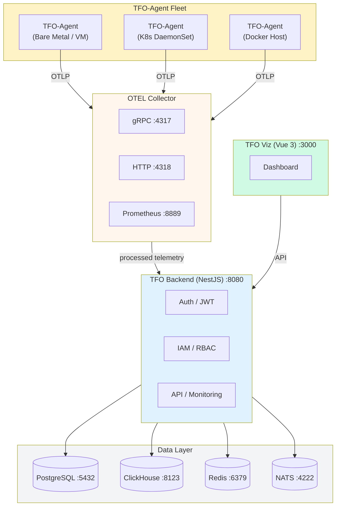
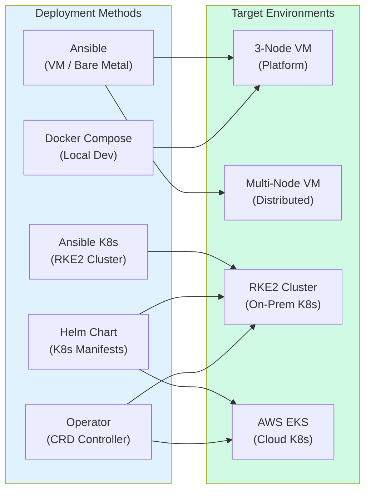
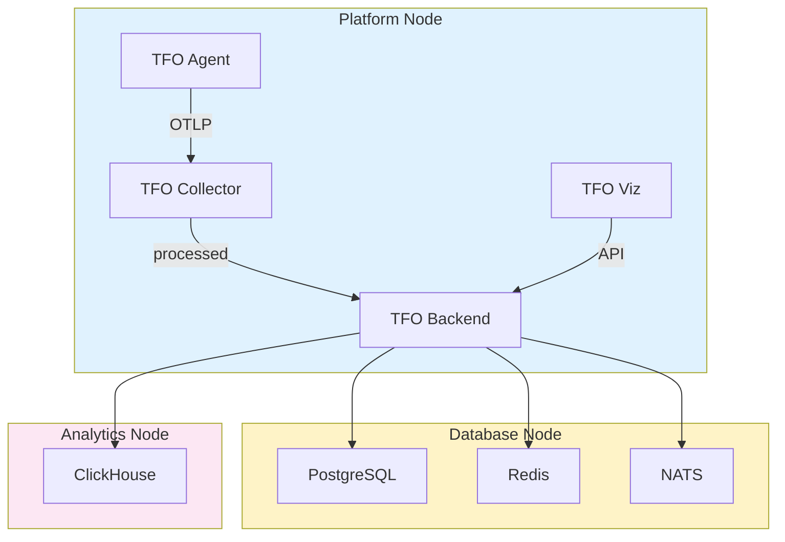

<div align="center">
  <picture>
    <source media="(prefers-color-scheme: dark)" srcset="https://github.com/telemetryflow/.github/raw/main/docs/assets/tfo-logo-dark.svg">
    <source media="(prefers-color-scheme: light)" srcset="https://github.com/telemetryflow/.github/raw/main/docs/assets/tfo-logo-light.svg">
    
  </picture>

  <h3>TelemetryFlow Deployment</h3>

[](CHANGELOG.md)
[](https://opensource.org/licenses/Apache-2.0)
[](https://hub.docker.com/r/telemetryflow/telemetryflow-platform)
[](https://go.dev/)
[](https://www.postgresql.org/)
[](https://clickhouse.com/)
[](https://redis.io/)
[](https://nats.io/)
[](https://docs.rke2.io/)
[](https://kubernetes.io/)
[](https://helm.sh/)
[](https://www.ansible.com/)

<center>Production-Ready Infrastructure & Deployment Standards for the
<br><strong>TelemetryFlow Observability Platform</strong></center>

</div>

---

## Overview

**TelemetryFlow Deployment** is the official infrastructure and deployment standards repository for the TelemetryFlow observability platform. It provides production-ready configuration templates, automation playbooks, Helm charts, a Kubernetes Operator, and Docker Compose setups for every deployment scenario — from single-node VMs to multi-node Kubernetes clusters and AWS EKS.

## Features

### Deployment Methods

- **Ansible (VM)**: Bare-metal and virtual machine provisioning with Docker Compose
- **Ansible (K8s)**: Kubernetes cluster bootstrap (RKE2/Rancher) with Helm integration
- **Helm Chart**: Standard Kubernetes deployment with environment overlay manifests
- **Kubernetes Operator**: Advanced deployment with custom resource management (Kubebuilder/Go 1.26)
- **Docker Compose**: Local development and single-node evaluation with profile-based service groups

### Infrastructure Components

- **PostgreSQL 16**: Relational database for IAM, configuration, and state
- **ClickHouse**: High-volume time-series storage for metrics, logs, and traces
- **Redis 7**: L1/L2 caching and BullMQ job queue backend
- **NATS 2.10**: JetStream messaging for domain events and real-time distribution
- **OpenTelemetry Collector**: OTLP-native telemetry ingestion (gRPC + HTTP)

### Architecture Patterns

- **4 Environment Overlays**: On-prem staging, on-prem production, EKS staging, EKS production
- **Manifest Overlay Pattern**: Single `values.yaml` base + environment-specific overlays
- **5-Tier RBAC Ready**: Configured for the TelemetryFlow 5-tier RBAC system
- **Security Hardened**: Non-root containers, read-only filesystems, network policies, secret management

## Architecture

### System Architecture



### Deployment Topology



### VM 3-Node Architecture



## Quick Start

### Prerequisites

| Tool    | Version | Purpose                    |
| ------- | ------- | -------------------------- |
| kubectl | >= 1.33 | Kubernetes CLI             |
| helm    | >= 3.14 | Kubernetes package manager |
| ansible | >= 2.16 | Infrastructure automation  |
| docker  | >= 24.0 | Container runtime          |
| go      | >= 1.26 | Operator build (optional)  |
| make    | any     | Task runner                |

Run `make verify` to check your environment.

### 1 — Docker Compose (Local Development)

```bash
# Clone and initialize
git clone https://github.com/telemetryflow/telemetryflow-deployment.git
cd telemetryflow-deployment
make init

# Start core services (Backend + PostgreSQL + ClickHouse + Redis + NATS)
make docker-up-core

# Or start everything
make docker-up-all
```

### 2 — Ansible (VM / Bare Metal)

```bash
cp .env.example .env            # Edit values
make env-setup

# Deploy to VMs
make ansible-vm-deploy

# Verify connectivity
make ansible-vm-ping
```

### 3 — Ansible (Kubernetes Cluster — RKE2)

```bash
make ansible-k8s-deploy
```

### 4 — Helm (Kubernetes)

```bash
# Staging (on-prem)
helm install telemetryflow ./helm/telemetryflow \
  -f ./helm/telemetryflow/values.yaml \
  -f ./manifest/tfo-staging.yaml \
  -n telemetryflow --create-namespace

# Production (on-prem)
helm install telemetryflow ./helm/telemetryflow \
  -f ./helm/telemetryflow/values.yaml \
  -f ./manifest/tfo-production.yaml \
  -n telemetryflow

# EKS Production
helm install telemetryflow ./helm/telemetryflow \
  -f ./helm/telemetryflow/values.yaml \
  -f ./manifest/tfo-eks-production.yaml \
  -n telemetryflow
```

### 5 — Operator (Advanced K8s)

```bash
make operator-install
make operator-run
```

## Repository Structure

```
telemetryflow-deployment/
├── .github/                              # GitHub Actions CI/CD workflows
│   └── workflows/
│       ├── ci.yml                        # CI pipeline (lint, test, build)
│       ├── release.yml                   # Release and tag workflow
│       ├── deploy-staging.yml            # On-prem staging (approval gate)
│       ├── deploy-production.yml         # On-prem production (2 reviewers)
│       ├── deploy-eks-staging.yml        # EKS staging (approval gate)
│       └── deploy-eks-production.yml     # EKS production (2 reviewers)
│
├── ansible/                              # Ansible — VM / bare-metal deployment
│   ├── ansible.cfg                       # Ansible configuration
│   ├── inventory.yml                     # VM inventory (tfo_agents + tfo_platform)
│   ├── group_vars/
│   │   ├── all.yml                       # Shared variables
│   │   ├── tfo_agents.yml                # Agent-specific variables
│   │   └── tfo_platform.yml              # Platform-specific variables
│   ├── host_vars/
│   │   ├── agent-01.yml                  # Agent node 1
│   │   ├── agent-02.yml                  # Agent node 2
│   │   ├── platform-node.yml             # Platform node (all-in-one)
│   │   ├── platform-db.yml               # Dedicated database node
│   │   └── platform-clickhouse.yml       # Dedicated ClickHouse node
│   ├── playbooks/
│   │   ├── site.yml                      # Main site playbook
│   │   ├── ping-all.yml                  # Connectivity check
│   │   ├── install-docker.yml            # Docker installation
│   │   ├── deploy-platform.yml           # Full platform deployment
│   │   ├── deploy-backend.yml            # TFO Backend only
│   │   ├── deploy-collector.yml          # TFO Collector only
│   │   ├── deploy-postgres.yml           # PostgreSQL only
│   │   ├── deploy-clickhouse.yml         # ClickHouse only
│   │   ├── deploy-agent.yml              # TFO Agent deployment
│   │   ├── cleanup-platform.yml          # Remove platform services
│   │   └── cleanup-agent.yml             # Remove agent services
│   ├── roles/
│   │   ├── docker-install/               # Docker Engine + Compose V2
│   │   ├── net-tools/                    # Network utilities
│   │   ├── tfo-platform/                 # Platform base setup
│   │   ├── tfo-backend/                  # NestJS backend (Docker Compose)
│   │   ├── tfo-viz/                      # Vue 3 frontend (Docker Compose + nginx)
│   │   ├── tfo-collector/                # OTEL Collector (Docker Compose)
│   │   ├── tfo-agent-binary/             # TFO Agent (systemd, native binary)
│   │   ├── tfo-postgres/                 # PostgreSQL (Docker Compose)
│   │   ├── tfo-clickhouse/               # ClickHouse (Docker Compose)
│   │   ├── tfo-redis/                    # Redis (Docker Compose)
│   │   ├── tfo-nats/                     # NATS (Docker Compose)
│   │   ├── tfo-portainer/                # Portainer (Docker Compose)
│   │   ├── cleanup-platform/             # Platform cleanup role
│   │   └── cleanup-agent/                # Agent cleanup role
│   ├── templates/                        # Shared templates
│   └── keys/                             # SSH key placeholders
│
├── ansible-k8s/                          # Ansible — Kubernetes cluster (RKE2)
│   ├── ansible.cfg                       # Ansible configuration
│   ├── inventory/
│   │   ├── hosts.yml                     # Cluster inventory (masters + workers)
│   │   ├── group_vars/all.yml            # Cluster variables
│   │   └── host_vars/
│   │       ├── master-01.yml             # Master node 1
│   │       └── worker-01.yml             # Worker node 1
│   ├── playbooks/
│   │   ├── 00-prerequisites.yml          # OS prerequisites
│   │   ├── 01-rke2-install.yml           # RKE2 cluster bootstrap
│   │   ├── 02-post-install.yml           # Post-install (kubectl, kubeconfig)
│   │   ├── 03-deploy-telemetryflow.yml   # Helm deploy TelemetryFlow
│   │   ├── 04-maintenance.yml            # Cluster maintenance
│   │   └── site.yml                      # Full site playbook
│   ├── roles/
│   │   ├── common/                       # OS hardening + NTP
│   │   ├── rke2/                         # RKE2 install + config
│   │   ├── helm/                         # Helm chart deployment
│   │   ├── post-install/                 # Post-cluster setup
│   │   └── maintenance/                  # Cluster maintenance tasks
│   └── docs/
│       ├── ARCHITECTURE.md               # K8s cluster architecture
│       ├── RUNBOOK.md                    # Operational runbook
│       └── VARIABLES.md                  # Variable reference
│
├── helm/                                 # Helm chart
│   └── telemetryflow/
│       ├── Chart.yaml                    # Chart metadata (v1.0.0)
│       ├── values.yaml                   # Single base values (770 lines)
│       ├── templates/
│       │   ├── _helpers.tpl              # Helm helper templates
│       │   ├── NOTES.txt                 # Post-install instructions
│       │   ├── namespace.yaml            # Namespace creation
│       │   ├── configmap-env.yaml        # Environment ConfigMap
│       │   ├── secrets.yaml              # Secrets (backend, agent, db)
│       │   ├── rbac.yaml                 # ServiceAccount + RBAC
│       │   ├── networkpolicies.yaml      # Network policies
│       │   ├── tfo-platform/
│       │   │   └── deployment.yaml       # TFO Backend Deployment
│       │   ├── tfo-viz/
│       │   │   └── deployment.yaml       # TFO Viz (Frontend) Deployment
│       │   ├── tfo-collector/
│       │   │   └── statefulset.yaml      # TFO Collector StatefulSet
│       │   ├── tfo-agent/
│       │   │   ├── daemonset.yaml        # TFO Agent DaemonSet
│       │   │   └── coredns-patch.yaml    # CoreDNS patch for agents
│       │   ├── postgresql/
│       │   │   └── statefulset.yaml      # PostgreSQL StatefulSet
│       │   ├── clickhouse/
│       │   │   └── statefulset.yaml      # ClickHouse StatefulSet
│       │   ├── redis-master/
│       │   │   └── statefulset.yaml      # Redis Master (BullMQ) StatefulSet
│       │   ├── cache-redis/
│       │   │   └── statefulset.yaml      # Cache Redis StatefulSet
│       │   ├── nats/
│       │   │   └── statefulset.yaml      # NATS JetStream StatefulSet
│       │   ├── bullmq/
│       │   │   ├── statefulset.yaml      # BullMQ Redis StatefulSet
│       │   │   └── board.yaml            # BullBoard (optional)
│       │   └── exporters/
│       │       ├── redis-exporter.yaml       # Redis metrics exporter
│       │       ├── nats-exporter.yaml        # NATS metrics exporter
│       │       ├── postgres-exporter.yaml    # PostgreSQL metrics exporter
│       │       └── clickhouse-exporter.yaml  # ClickHouse metrics exporter
│       └── manifest/                     # Environment overlay values
│           ├── tfo-staging.yaml          # On-prem staging overlay
│           ├── tfo-production.yaml       # On-prem production overlay
│           ├── tfo-eks-staging.yaml      # EKS staging overlay
│           └── tfo-eks-production.yaml   # EKS production overlay
│
├── operator/                             # Kubernetes Operator (Kubebuilder / Go 1.26)
│   ├── main.go                           # Operator entrypoint
│   ├── go.mod                            # Go module (controller-runtime v0.20.4)
│   ├── Makefile                          # Build, test, deploy targets
│   ├── Dockerfile                        # Multi-stage (golang:1.26 → alpine:3.21)
│   ├── PROJECT                           # Kubebuilder project metadata
│   ├── api/v1alpha1/
│   │   └── telemetryflow_types.go        # CRD spec/status types
│   ├── internal/controller/
│   │   ├── telemetryflow_controller.go   # Reconciler (9 components + finalizer)
│   │   └── suite_test.go                 # Unit tests (envtest, K8s 1.32.0)
│   ├── test/e2e/
│   │   ├── e2e_suite_test.go             # E2E suite setup (kubeconfig + namespace)
│   │   ├── e2e_test.go                   # 4 test cases (full, minimal, delete, update)
│   │   └── README.md                     # E2E testing guide
│   └── config/
│       ├── crd/                          # Generated CRD manifests
│       ├── manager/                      # Controller manager deployment
│       ├── rbac/                         # Role + RoleBinding
│       └── samples/                      # Example TelemetryFlow CR
│
├── manifest/                             # Root-level environment overlays
│   ├── tfo-staging.yaml                  # On-prem staging overlay
│   ├── tfo-production.yaml               # On-prem production overlay
│   ├── tfo-eks-staging.yaml              # EKS staging overlay
│   └── tfo-eks-production.yaml           # EKS production overlay
│
├── scripts/                              # Deployment and utility scripts
│   ├── deploy-staging.sh                 # Staging deployment helper
│   ├── deploy-production.sh              # Production deployment helper
│   ├── install-crds.sh                   # CRD installation script
│   ├── generate-secrets.sh               # Secret generation utility
│   └── init-volumes.sh                   # Volume initialization script
│
├── docs/                                 # Comprehensive documentation
│   ├── README.md                         # Documentation index
│   ├── ARCHITECTURE.md                   # System architecture with Mermaid diagrams
│   ├── DEPLOYMENT.md                     # Step-by-step deployment guide
│   ├── ANSIBLE-GUIDE.md                  # VM provisioning with Ansible
│   ├── HELM-GUIDE.md                     # Helm chart configuration
│   ├── OPERATOR-GUIDE.md                 # K8s Operator development guide
│   ├── DOCKER-COMPOSE-GUIDE.md           # Local development setup
│   ├── SECURITY-GUIDE.md                 # Security hardening reference
│   ├── MONITORING.md                     # Monitoring and alerting setup
│   ├── NETWORKING.md                     # Network architecture and policies
│   └── CI-CD-GUIDE.md                    # CI/CD pipeline configuration
│
├── docker-compose.yml                    # Docker Compose (12 services, 4 profiles)
├── .env.example                          # Environment template (936 lines, 26 sections)
├── .gitlab-ci.yml                        # GitLab CI/CD pipeline (6 stages, 11 jobs)
├── Makefile                              # Top-level task runner
├── CHANGELOG.md                          # Version history
├── CONTRIBUTING.md                       # Contribution guidelines
├── SECURITY.md                           # Security policy
├── LICENSE                               # Apache License 2.0
└── README.md                             # This file
```

## Deployment Methods

| Method          | Path                  | Use Case                                                       |
| --------------- | --------------------- | -------------------------------------------------------------- |
| **Ansible**     | `ansible/`            | Bare-metal, VM, or hybrid infrastructure provisioning          |
| **Ansible K8s** | `ansible-k8s/`        | Kubernetes cluster deployment (RKE2/Rancher, Helm)             |
| **Helm**        | `helm/telemetryflow/` | Standard Kubernetes deployment with templated manifests        |
| **Operator**    | `operator/`           | Advanced Kubernetes deployment with custom resource management |
| **Docker**      | `docker-compose.yml`  | Local development and single-node evaluation                   |

## Helm Environment Overlays

The Helm chart uses a manifest overlay pattern — a single `values.yaml` base with environment-specific overlays:

```bash
# Pattern: -f values.yaml -f manifest/<overlay>.yaml
helm install telemetryflow ./helm/telemetryflow \
  -f ./helm/telemetryflow/values.yaml \
  -f ./manifest/tfo-staging.yaml \
  -n telemetryflow
```

| Overlay                   | Environment    | Target    |
| ------------------------- | -------------- | --------- |
| `tfo-staging.yaml`        | Staging        | On-prem   |
| `tfo-production.yaml`     | Production     | On-prem   |
| `tfo-eks-staging.yaml`    | EKS Staging    | AWS Cloud |
| `tfo-eks-production.yaml` | EKS Production | AWS Cloud |

## CI/CD

### GitHub Actions

| Workflow                    | Trigger | Approval Required |
| --------------------------- | ------- | ----------------- |
| `ci.yml`                    | Push/PR | No                |
| `release.yml`               | Tag     | No                |
| `deploy-staging.yml`        | Manual  | Yes (1 reviewer)  |
| `deploy-production.yml`     | Manual  | Yes (2 reviewers) |
| `deploy-eks-staging.yml`    | Manual  | Yes (1 reviewer)  |
| `deploy-eks-production.yml` | Manual  | Yes (2 reviewers) |

### GitLab CI/CD

6 stages with manual approval gates for staging/production deployments.

See [docs/CI-CD-GUIDE.md](./docs/CI-CD-GUIDE.md) for full details.

## Makefile Commands

```bash
make help                       # Show all available commands
make init                       # Initialize project (dirs, env, secrets)
make verify                     # Check prerequisites

# Ansible (VM)
make ansible-vm-ping            # Ping VM hosts
make ansible-vm-deploy          # Deploy to VMs

# Ansible (K8s)
make ansible-k8s-deploy         # Deploy K8s cluster via Ansible

# Helm
make helm-install               # Install Helm chart (staging)
make helm-upgrade               # Upgrade Helm release

# Operator
make operator-install           # Install CRDs
make operator-run               # Run operator locally
make operator-deploy            # Deploy operator to cluster

# Docker Compose
make docker-up-core             # Core services only
make docker-up-all              # All services + agents
make docker-down                # Stop all services

# Testing
make operator-test              # Run operator unit tests (envtest)
make operator-test-e2e          # Run operator e2e tests (real cluster)
```

## Documentation

| Resource             | Link                                                           | Description                          |
| -------------------- | -------------------------------------------------------------- | ------------------------------------ |
| Architecture         | [docs/ARCHITECTURE.md](./docs/ARCHITECTURE.md)                 | System architecture and diagrams     |
| Deployment Guide     | [docs/DEPLOYMENT.md](./docs/DEPLOYMENT.md)                     | Step-by-step deployment instructions |
| Ansible Guide        | [docs/ANSIBLE-GUIDE.md](./docs/ANSIBLE-GUIDE.md)               | VM provisioning with Ansible         |
| Helm Guide           | [docs/HELM-GUIDE.md](./docs/HELM-GUIDE.md)                     | Helm chart configuration and usage   |
| Operator Guide       | [docs/OPERATOR-GUIDE.md](./docs/OPERATOR-GUIDE.md)             | K8s Operator development             |
| Docker Compose Guide | [docs/DOCKER-COMPOSE-GUIDE.md](./docs/DOCKER-COMPOSE-GUIDE.md) | Local development setup              |
| Security Guide       | [docs/SECURITY-GUIDE.md](./docs/SECURITY-GUIDE.md)             | Security hardening                   |
| Monitoring Guide     | [docs/MONITORING.md](./docs/MONITORING.md)                     | Monitoring and alerting setup        |
| Networking Guide     | [docs/NETWORKING.md](./docs/NETWORKING.md)                     | Network architecture and policies    |
| CI/CD Guide          | [docs/CI-CD-GUIDE.md](./docs/CI-CD-GUIDE.md)                   | Pipeline configuration               |
| Contributing         | [CONTRIBUTING.md](./CONTRIBUTING.md)                           | Contribution guidelines              |
| Security Policy      | [SECURITY.md](./SECURITY.md)                                   | Vulnerability reporting              |
| Changelog            | [CHANGELOG.md](./CHANGELOG.md)                                 | Version history and changes          |
| License              | [LICENSE](./LICENSE)                                           | Apache License 2.0                   |

## Technology Stack

| Category        | Technology                 | Version |
| --------------- | -------------------------- | ------- |
| Container       | Docker                     | >= 24.0 |
| Orchestration   | Kubernetes (RKE2 / EKS)    | >= 1.33 |
| Package Manager | Helm                       | >= 3.14 |
| Automation      | Ansible                    | >= 2.16 |
| Operator        | Go + Kubebuilder           | >= 1.26 |
| Database        | PostgreSQL                 | 16      |
| Time-Series     | ClickHouse                 | 24.x    |
| Cache/Queue     | Redis                      | 7.x     |
| Messaging       | NATS JetStream             | 2.10+   |
| Telemetry       | OpenTelemetry Collector    | Latest  |
| Backend         | NestJS (TFO Backend)       | 11.x    |
| Frontend        | Vue 3 (TFO Viz)            | 3.5+    |
| CI/CD           | GitHub Actions + GitLab CI | N/A     |

## Security

- Non-root containers (`runAsNonRoot: true`)
- Read-only root filesystems where possible
- Network policies for pod-to-pod traffic isolation
- Secrets management with placeholder values (`<CHANGE_ME>`)
- RBAC with least-privilege service accounts
- Container image scanning in CI pipeline
- Security hardening in Ansible roles (`common` role)

See [SECURITY.md](./SECURITY.md) and [docs/SECURITY-GUIDE.md](./docs/SECURITY-GUIDE.md) for details.

## Contributing

We welcome contributions! Please read the [Contributing Guide](./CONTRIBUTING.md) for details on our code of conduct and the process for submitting pull requests.

## License

Apache License 2.0 — see [LICENSE](./LICENSE) for details.

## Support

- **Documentation**: [docs/](./docs/)
- **Issues**: [GitHub Issues](https://github.com/telemetryflow/telemetryflow-deployment/issues)
- **Discussions**: [GitHub Discussions](https://github.com/telemetryflow/telemetryflow-deployment/discussions)
- **Security**: [SECURITY.md](./SECURITY.md)

## Acknowledgments

Part of [TelemetryFlow Platform](https://github.com/telemetryflow/telemetryflow-platform) — AI-Powered Observability (Community Enterprise Observability Platform).

---

**Built with ❤️ by Telemetri Data Indonesia**
