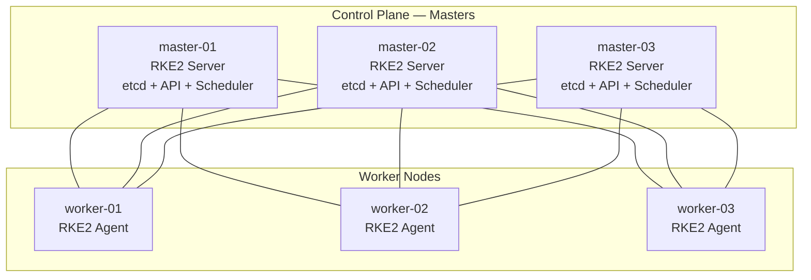
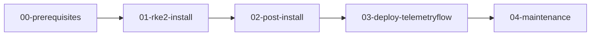
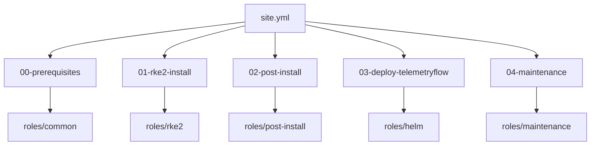
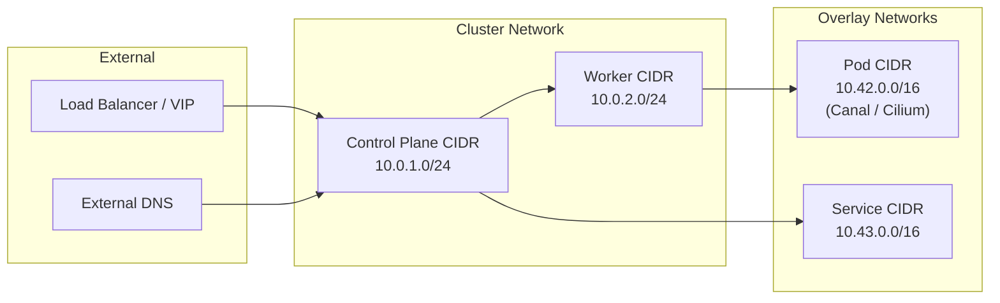

# Architecture — TelemetryFlow Kubernetes Cluster

## Overview

TelemetryFlow is deployed on an RKE2 (Rancher) Kubernetes cluster provisioned via Ansible. The architecture follows a control-plane / worker-node pattern suitable for on-premises and edge deployments.

## Cluster Topology



## Deployment Pipeline



## Ansible Role Interaction



## Network Layout



## Component Stack

| Layer         | Component            | Purpose                                   |
| ------------- | -------------------- | ----------------------------------------- |
| OS            | Ubuntu 22.04/24.04   | Base operating system                     |
| Container     | containerd (RKE2)    | Container runtime                         |
| Orchestration | RKE2 v1.31.x         | Kubernetes distribution                   |
| CNI           | Canal / Cilium       | Pod networking                            |
| DNS           | CoreDNS              | Cluster DNS resolution                    |
| Ingress       | NGINX / Traefik      | HTTP/HTTPS traffic routing                |
| Storage       | Local / NFS / CSI    | Persistent volume provisioning            |
| Deploy        | Helm                 | TelemetryFlow application deployment      |
| Monitoring    | TelemetryFlow Agent  | Observability data collection             |

## Directory Structure

```
ansible-k8s/
├── ansible.cfg
├── inventory/
│   ├── hosts.yml
│   └── group_vars/
│       └── all.yml
├── playbooks/
│   ├── 00-prerequisites.yml
│   ├── 01-rke2-install.yml
│   ├── 02-post-install.yml
│   ├── 03-deploy-telemetryflow.yml
│   ├── 04-maintenance.yml
│   └── site.yml
├── roles/
│   ├── common/
│   ├── rke2/
│   ├── helm/
│   ├── post-install/
│   └── maintenance/
└── docs/
    ├── ARCHITECTURE.md
    ├── RUNBOOK.md
    └── VARIABLES.md
```
