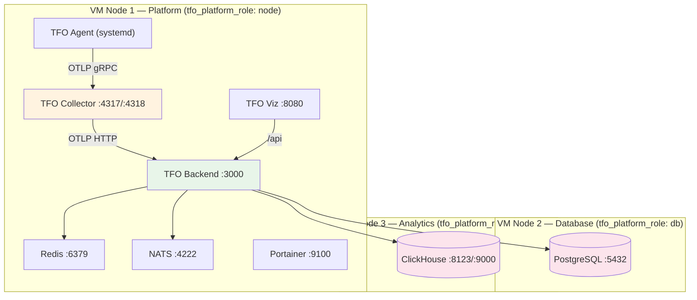
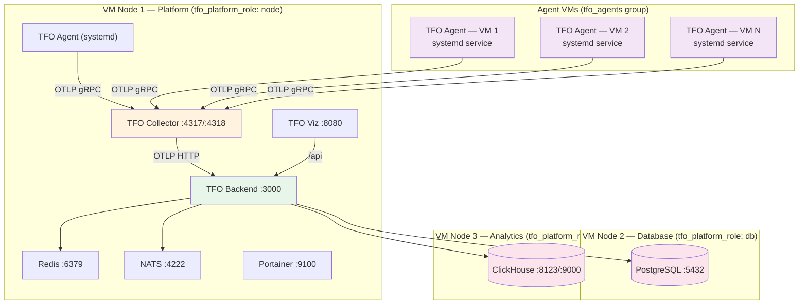
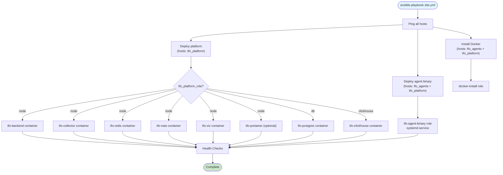
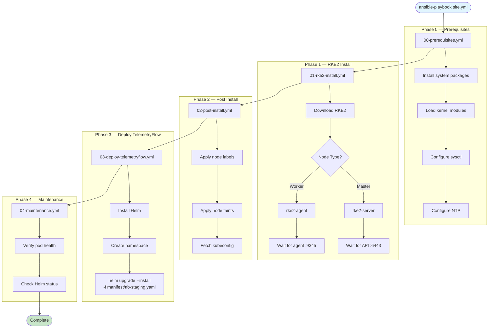
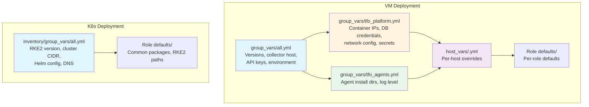

# Ansible Guide

Detailed guide for deploying TelemetryFlow using Ansible for both VM/bare-metal and Kubernetes (RKE2) environments.

## VM 3-Node Deployment

Deploys TelemetryFlow across three VMs with dedicated roles: platform, database, and analytics.



## VM Multi-Node Deployment

Extends the 3-node layout with dedicated agent VMs for distributed host monitoring.



## VM Deployment Workflow



### Playbook Execution Order

| Playbook                | Hosts                     | Purpose                                   |
| ----------------------- | ------------------------- | ----------------------------------------- |
| `site.yml`              | all                       | Master playbook — orchestrates all others |
| `ping-all.yml`          | all                       | Connectivity test                         |
| `install-docker.yml`    | tfo_agents, tfo_platform  | Install Docker Engine + Compose           |
| `deploy-platform.yml`   | tfo_platform              | Dispatch sub-roles by `tfo_platform_role` |
| `deploy-postgres.yml`   | tfo_platform (db)         | PostgreSQL container                      |
| `deploy-clickhouse.yml` | tfo_platform (clickhouse) | ClickHouse container                      |
| `deploy-backend.yml`    | tfo_platform (node)       | Backend container                         |
| `deploy-collector.yml`  | tfo_platform (node)       | Collector container                       |
| `deploy-agent.yml`      | tfo_agents, tfo_platform  | Agent systemd service                     |
| `cleanup-platform.yml`  | tfo_platform              | Remove platform containers                |
| `cleanup-agent.yml`     | tfo_agents                | Remove agent binary and service           |

## K8s Deployment Workflow

Provisions an RKE2 Kubernetes cluster from bare-metal/VM nodes, then deploys TelemetryFlow via Helm.



## Inventory Configuration

### VM Inventory (`ansible/inventory.yml`)

```yaml
all:
  vars:
    ansible_python_interpreter: /usr/bin/python3
    ansible_ssh_common_args: "-o StrictHostKeyChecking=no"

  tfo_agents:
    hosts:
      agent-01:
        ansible_host: 10.0.0.10
        ansible_user: "<CHANGE_ME>"

  tfo_platform:
    children:
      tfo_node:
        hosts:
          platform-node:
            ansible_host: 10.0.1.10
            ansible_user: "<CHANGE_ME>"
            tfo_platform_role: node
      tfo_db:
        hosts:
          platform-db:
            ansible_host: 10.0.1.20
            ansible_user: "<CHANGE_ME>"
            tfo_platform_role: db
      tfo_clickhouse:
        hosts:
          platform-clickhouse:
            ansible_host: 10.0.1.30
            ansible_user: "<CHANGE_ME>"
            tfo_platform_role: clickhouse
```

### K8s Inventory (`ansible-k8s/inventory/hosts.yml`)

```yaml
all:
  children:
    masters:
      hosts:
        master-01:
          ansible_host: 10.0.1.10
    workers:
      hosts:
        worker-01:
          ansible_host: 10.0.2.10
  vars:
    ansible_python_interpreter: /usr/bin/python3
    ansible_user: ubuntu
```

### host_vars Configuration

Per-host variables override group_vars for node-specific settings:

```yaml
# ansible/host_vars/platform-node.yml
ansible_host: 10.0.1.10
tfo_platform_role: node
tfo_backend_port: 3000
tfo_collector_grpc_port: 4317

# ansible/host_vars/platform-db.yml
ansible_host: 10.0.1.20
tfo_platform_role: db
tfo_postgres_port: 5432

# ansible/host_vars/agent-01.yml
ansible_host: 10.0.0.10
tfo_collector_host: "10.0.1.10"
tfo_collector_grpc_port: 4317
```

## Variable Hierarchy



### Priority Order (highest to lowest)

1. **CLI extra vars** (`-e "key=value"`)
2. **host_vars** (by host)
3. **group_vars** (by group)
4. **Role defaults** (`roles/<role>/defaults/main.yml`)

## Role Descriptions

### VM Roles (`ansible/roles/`)

| Role               | Purpose                                                               | Key Defaults                                                        |
| ------------------ | --------------------------------------------------------------------- | ------------------------------------------------------------------- |
| `docker-install`   | Installs Docker Engine and Compose plugin                             | `docker_engine_version: "25.0"`, `docker_compose_version: "2.24.5"` |
| `net-tools`        | Installs network diagnostic utilities                                 | curl, wget, iproute2                                                |
| `tfo-platform`     | Orchestrator role — dispatches sub-roles based on `tfo_platform_role` | —                                                                   |
| `tfo-postgres`     | Deploys PostgreSQL container                                          | Image: `postgres:16-alpine`, Port: 5432                             |
| `tfo-clickhouse`   | Deploys ClickHouse container                                          | Image: `clickhouse/clickhouse-server:24-alpine`                     |
| `tfo-redis`        | Deploys Redis container                                               | Image: `redis:7-alpine`                                             |
| `tfo-nats`         | Deploys NATS JetStream container                                      | Image: `nats:2-alpine`                                              |
| `tfo-backend`      | Deploys TFO Backend container                                         | Health check on `:3000`                                             |
| `tfo-collector`    | Deploys OTel Collector container                                      | Image: `otel/opentelemetry-collector-contrib:latest`                |
| `tfo-viz`          | Deploys TFO Viz frontend container                                    | HTTP port 80                                                        |
| `tfo-agent-binary` | Installs TFO Agent as systemd service                                 | Binary from releases.telemetryflow.io                               |
| `tfo-portainer`    | Deploys Portainer CE container (optional)                             | Controlled by `tfo_portainer_enabled`                               |
| `cleanup-platform` | Removes platform containers and data                                  | —                                                                   |
| `cleanup-agent`    | Removes agent binary and systemd service                              | —                                                                   |

### K8s Roles (`ansible-k8s/roles/`)

| Role           | Purpose                                                    |
| -------------- | ---------------------------------------------------------- |
| `common`       | System packages, kernel modules, sysctl configuration      |
| `rke2`         | Download, install, and configure RKE2 server/agent         |
| `post-install` | Node labels, taints, and kubeconfig retrieval              |
| `helm`         | Install Helm, create namespace, deploy TelemetryFlow chart |
| `maintenance`  | Post-deployment health verification                        |

## Common Operations

### Deploy

```bash
# Full VM deployment
ansible-playbook ansible/playbooks/site.yml -i ansible/inventory.yml

# Full K8s deployment
cd ansible-k8s && ansible-playbook playbooks/site.yml

# Specific component only
ansible-playbook ansible/playbooks/deploy-backend.yml -i ansible/inventory.yml --tags backend
```

### Update

```bash
# Update a single component image
ansible-playbook ansible/playbooks/deploy-backend.yml -i ansible/inventory.yml \
  -e "tfo_backend_version=1.5.0"

# Update K8s via Helm
cd ansible-k8s
ansible-playbook playbooks/03-deploy-telemetryflow.yml \
  -e "telemetryflow_chart_version=1.1.0"
```

### Rollback

```bash
# VM — redeploy previous version
ansible-playbook ansible/playbooks/deploy-backend.yml -i ansible/inventory.yml \
  -e "tfo_backend_version=1.4.2"

# K8s — Helm rollback
helm rollback telemetryflow <REVISION> -n telemetryflow
```

### Scale

```bash
# Add a new agent host — add to inventory, then:
ansible-playbook ansible/playbooks/deploy-agent.yml -i ansible/inventory.yml --limit agent-03

# Add a K8s worker — add to inventory, then:
cd ansible-k8s
ansible-playbook playbooks/00-prerequisites.yml --limit worker-04
ansible-playbook playbooks/01-rke2-install.yml --limit worker-04
```

## Troubleshooting

### VM Deployment

| Issue                 | Diagnosis                                           | Resolution                                     |
| --------------------- | --------------------------------------------------- | ---------------------------------------------- |
| Host unreachable      | `ansible all -m ping`                               | Check SSH access, firewall, inventory IPs      |
| Docker not installed  | `ssh host "docker --version"`                       | Run `install-docker.yml` playbook              |
| Container won't start | `docker logs <container>`                           | Check environment variables and ports          |
| Network conflict      | `docker network inspect telemetryflow_platform_net` | Adjust subnet in `group_vars/tfo_platform.yml` |
| Agent not reporting   | `systemctl status tfo-agent`                        | Verify collector host and port                 |

### K8s Deployment

| Issue                   | Diagnosis                                    | Resolution                                   |
| ----------------------- | -------------------------------------------- | -------------------------------------------- |
| RKE2 server won't start | `journalctl -u rke2-server -f`               | Check `rke2_token`, firewall ports 6443/9345 |
| Worker not joining      | `journalctl -u rke2-agent -f`                | Verify token, server IP, port 9345           |
| Helm install fails      | `helm status telemetryflow -n telemetryflow` | Check manifest file, chart version           |
| Pods pending            | `kubectl describe pod <name>`                | Check node resources, PVC binding            |
| etcd issues             | `etcdctl endpoint health`                    | Check disk space, quorum                     |

### Useful Commands

```bash
# Verbose Ansible output
ansible-playbook site.yml -vvv

# Dry run (check mode)
ansible-playbook site.yml --check

# Limit to specific hosts
ansible-playbook site.yml --limit platform-node

# Tags only
ansible-playbook site.yml --tags backend
```
