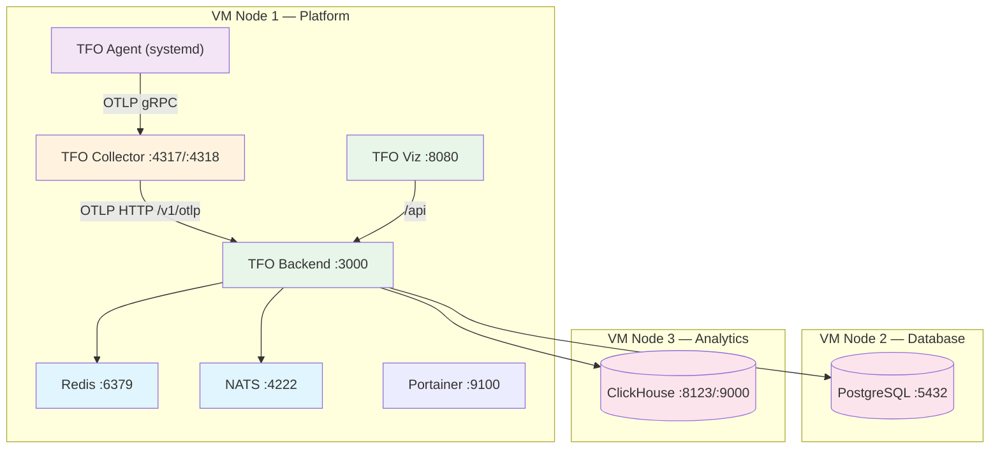
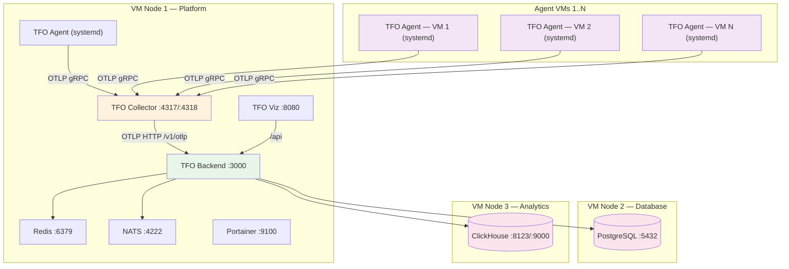
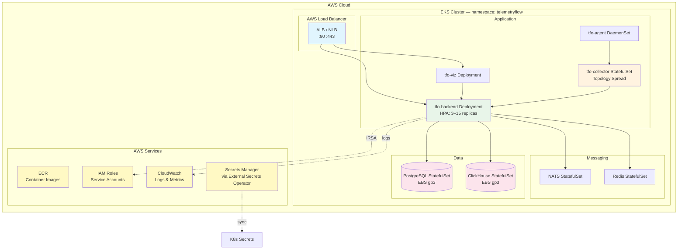
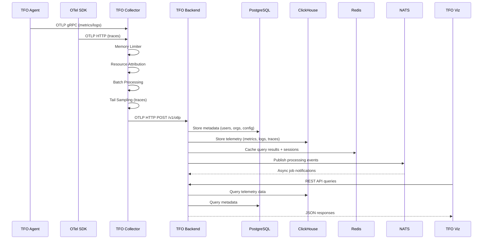

# Architecture

TelemetryFlow is an enterprise-grade observability platform built on OpenTelemetry (OTLP). It collects, processes, stores, and visualizes metrics, logs, and traces from instrumented applications and infrastructure.

## VM 3-Node Architecture

Deploys to three VMs with roles split by function. All services run as Docker containers on a private bridge network, with the agent running as a systemd service on the platform node.

## VM Multi-Node Architecture

Extends the 3-node layout with dedicated agent VMs for distributed host monitoring. Each agent sends telemetry to the collector on the platform node.

## Kubernetes Cluster Architecture

All components run as Kubernetes workloads within the `telemetryflow` namespace. Ingress exposes the frontend and API; the agent DaemonSet runs on every node.

```mermaid
graph TB
    subgraph "Kubernetes Cluster — namespace: telemetryflow"
        direction TB

        subgraph "Ingress"
            ING["NGINX Ingress Controller<br/>:80 :443"]
        end

        subgraph "Application"
            VIZ["tfo-viz Deployment<br/>:8080"]
            BACK["tfo-backend Deployment<br/>:8080"]
            COL["tfo-collector StatefulSet<br/>:4317 :4318"]
            AGT["tfo-agent DaemonSet<br/>hostNetwork: true"]
        end

        subgraph "Messaging"
            NATS["NATS StatefulSet<br/>:4222"]
            RDS["Redis StatefulSet<br/>:6379"]
        end

        subgraph "Data"
            PG[("PostgreSQL StatefulSet<br/>:5432")]
            CH[("ClickHouse StatefulSet<br/>:8123 :9000")]
        end
    end

    USERS["Users / Browsers"] --> ING
    ING --> VIZ
    ING --> BACK
    VIZ --> BACK
    BACK --> PG & CH & RDS & NATS
    COL --> BACK
    AGT -->|"every node"| COL

    style USERS fill:#f3e5f5
    style ING fill:#e1f5fe
    style BACK fill:#e8f5e9
    style COL fill:#fff3e0
    style PG fill:#fce4ec
    style CH fill:#fce4ec
```

## EKS Hyperscale Architecture

Extended Kubernetes architecture on AWS EKS with cloud-native integrations for production-grade hyperscale deployments.

## Data Flow

## Component Responsibilities

| Component          | Role                                                        | Protocol                   | Storage                             |
| ------------------ | ----------------------------------------------------------- | -------------------------- | ----------------------------------- |
| **TFO Agent**      | Collects host and K8s metrics, scrapes Prometheus endpoints | OTLP gRPC                  | N/A (stateless)                     |
| **TFO Collector**  | Receives, processes, batches, and routes telemetry          | OTLP gRPC/HTTP             | Queue (in-memory)                   |
| **TFO Backend**    | API server, data processing, multi-tenancy, RBAC            | HTTP REST, gRPC            | PostgreSQL, ClickHouse, Redis, NATS |
| **TFO Viz**        | Web-based dashboard and visualization                       | HTTP                       | N/A (stateless)                     |
| **PostgreSQL**     | Relational metadata store (users, orgs, configs, alerts)    | PostgreSQL wire            | Persistent volume                   |
| **ClickHouse**     | Columnar telemetry store (metrics, logs, traces)            | HTTP (8123), Native (9000) | Persistent volume                   |
| **Redis**          | Session cache, query cache, BullMQ job queue                | Redis protocol             | Persistent volume                   |
| **NATS JetStream** | Asynchronous event bus for internal notifications           | NATS protocol              | Persistent volume                   |
| **Portainer**      | Docker management UI (optional tooling)                     | HTTP                       | Docker socket + volume              |

## Technology Stack

| Layer                | Technology           | Version              | Purpose                        |
| -------------------- | -------------------- | -------------------- | ------------------------------ |
| Language (Backend)   | Node.js / TypeScript | —                    | API server and processing      |
| Language (Agent)     | Go                   | >= 1.26              | Host/K8s metrics collection    |
| Language (Operator)  | Go                   | >= 1.26              | Kubernetes controller          |
| Frontend             | Vite + React         | —                    | Dashboard UI                   |
| Container Runtime    | Docker / containerd  | 24.0+ / RKE2 bundled | Container execution            |
| Orchestration        | Kubernetes (RKE2)    | >= 1.33              | Container orchestration        |
| CNI                  | Canal / Cilium       | —                    | Pod networking                 |
| Ingress              | NGINX / Traefik      | —                    | HTTP/HTTPS routing             |
| Configuration        | Ansible              | >= 2.16              | Infrastructure automation      |
| Package Management   | Helm                 | >= 3.14              | K8s application deployment     |
| Operator Framework   | Kubebuilder          | v4                   | CRD and controller scaffolding |
| Database (metadata)  | PostgreSQL           | 16-alpine            | Relational data                |
| Database (telemetry) | ClickHouse           | latest               | Time-series / OLAP             |
| Cache                | Redis                | 7-alpine             | Caching and job queues         |
| Messaging            | NATS JetStream       | 2.10-alpine          | Event streaming                |
| Container Management | Portainer CE         | latest               | Docker UI (optional)           |

## Port Reference

| Port  | Protocol | Service                     | Exposure         | Description           |
| ----- | -------- | --------------------------- | ---------------- | --------------------- |
| 80    | HTTP     | Ingress                     | External         | Frontend dashboard    |
| 443   | HTTPS    | Ingress (TLS)               | External         | TLS frontend + API    |
| 3000  | HTTP     | TFO Backend                 | External (VM)    | REST API server       |
| 8080  | HTTP     | TFO Backend (K8s) / TFO Viz | Internal         | Container ports       |
| 4317  | gRPC     | TFO Collector               | Agents only      | OTLP gRPC receiver    |
| 4318  | HTTP     | TFO Collector               | Agents only      | OTLP HTTP receiver    |
| 8889  | HTTP     | TFO Collector               | Internal         | Prometheus metrics    |
| 13133 | HTTP     | Collector / Agent           | Internal         | Health check          |
| 5432  | TCP      | PostgreSQL                  | Internal only    | PostgreSQL wire       |
| 8123  | HTTP     | ClickHouse                  | Internal only    | HTTP interface        |
| 9000  | TCP      | ClickHouse                  | Internal only    | Native protocol       |
| 6379  | TCP      | Redis                       | Internal only    | Redis protocol        |
| 4222  | TCP      | NATS                        | Internal only    | Client connections    |
| 8222  | HTTP     | NATS                        | Internal only    | Management/monitoring |
| 9100  | HTTP     | Portainer                   | External (VM)    | Docker management UI  |
| 6443  | TCP      | Kubernetes API              | Control plane    | API server            |
| 9345  | TCP      | RKE2 Server                 | Cluster internal | RKE2 communication    |
