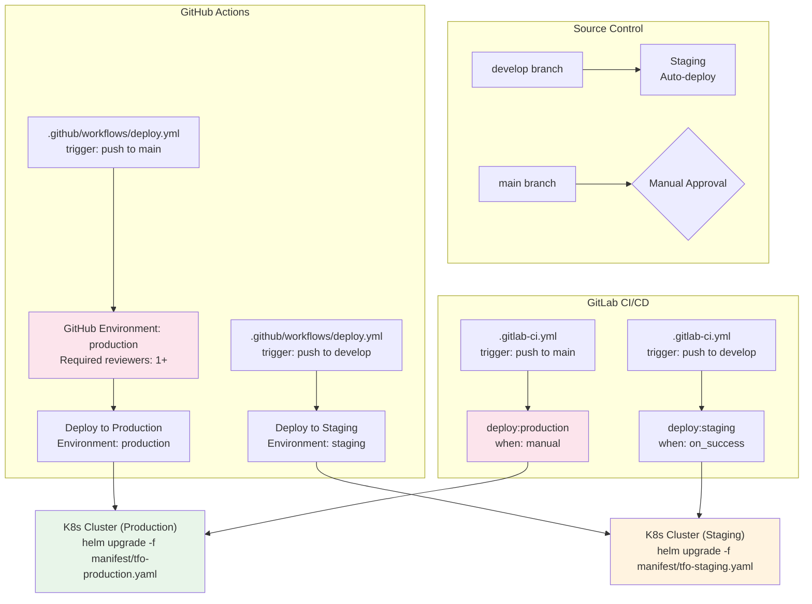
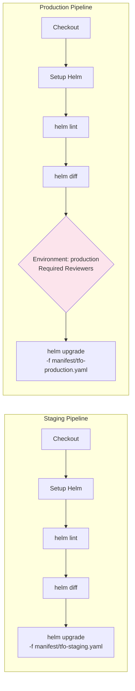
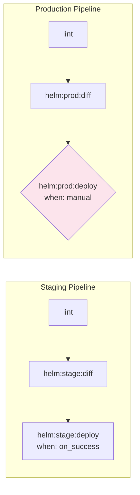

# CI/CD Guide

Automated deployment pipelines for TelemetryFlow using GitHub Actions and GitLab CI/CD. Production deployments require manual approval in both systems.

## Pipeline Architecture



## GitHub Actions

### Workflow Structure

The deployment workflow is defined in `.github/workflows/deploy.yml` and uses GitHub Environments for approval gates.



### Environment Configuration

Configure GitHub Environments under **Settings > Environments**:

#### Staging Environment

| Setting            | Value              |
| ------------------ | ------------------ |
| Name               | `staging`          |
| Required reviewers | None (auto-deploy) |
| Deployment branch  | `develop`          |
| Kubernetes context | `staging-cluster`  |

#### Production Environment

| Setting            | Value                  |
| ------------------ | ---------------------- |
| Name               | `production`           |
| Required reviewers | 1+ (team leads / SREs) |
| Deployment branch  | `main`                 |
| Wait timer         | 5 minutes (optional)   |
| Kubernetes context | `production-cluster`   |

### Example Workflow

```yaml
name: Deploy TelemetryFlow

on:
  push:
    branches: [develop, main]

jobs:
  lint:
    runs-on: ubuntu-latest
    steps:
      - uses: actions/checkout@v4
      - name: Lint Helm chart
        run: make helm-lint

  deploy-staging:
    needs: lint
    if: github.ref == 'refs/heads/develop'
    environment: staging
    runs-on: ubuntu-latest
    steps:
      - uses: actions/checkout@v4
      - name: Setup Helm
        uses: azure/setup-helm@v4
      - name: Deploy to staging
        run: |
          helm upgrade telemetryflow ./helm/telemetryflow \
            --install \
            --namespace telemetryflow --create-namespace \
            -f ./manifest/tfo-staging.yaml \
            --timeout 5m --wait

  deploy-production:
    needs: lint
    if: github.ref == 'refs/heads/main'
    environment: production
    runs-on: ubuntu-latest
    steps:
      - uses: actions/checkout@v4
      - name: Setup Helm
        uses: azure/setup-helm@v4
      - name: Diff
        run: |
          helm diff upgrade telemetryflow ./helm/telemetryflow \
            -f ./manifest/tfo-production.yaml
      - name: Deploy to production
        run: |
          helm upgrade telemetryflow ./helm/telemetryflow \
            --install \
            --namespace telemetryflow --create-namespace \
            -f ./manifest/tfo-production.yaml \
            --timeout 10m --wait
```

### Secrets Configuration

Store the following as GitHub repository secrets (**Settings > Secrets and variables > Actions**):

| Secret                   | Description                 |
| ------------------------ | --------------------------- |
| `KUBE_CONFIG_STAGING`    | Base64-encoded kubeconfig   |
| `KUBE_CONFIG_PRODUCTION` | Base64-encoded kubeconfig   |
| `HELM_SECRETS_KEY`       | Helm Secrets decryption key |

## GitLab CI/CD

### Pipeline Structure

Defined in `.gitlab-ci.yml` with manual job gates using `when: manual`.



### Example Pipeline

```yaml
stages:
  - lint
  - diff
  - deploy

variables:
  HELM_CHART: ./helm/telemetryflow
  NAMESPACE: telemetryflow

.lint:
  stage: lint
  image: alpine/helm:3.14
  script:
    - helm lint ${HELM_CHART}

lint-staging:
  extends: .lint
  only:
    - develop

lint-production:
  extends: .lint
  only:
    - main

.diff-staging:
  stage: diff
  image: alpine/helm:3.14
  script:
    - helm diff upgrade telemetryflow ${HELM_CHART}
      -f ${HELM_CHART}/manifest/tfo-staging.yaml
  only:
    - develop

.diff-production:
  stage: diff
  image: alpine/helm:3.14
  script:
    - helm diff upgrade telemetryflow ${HELM_CHART}
      -f ${HELM_CHART}/manifest/tfo-production.yaml
  only:
    - main

deploy-staging:
  stage: deploy
  image: alpine/helm:3.14
  script:
    - helm upgrade telemetryflow ${HELM_CHART}
      --install
      --namespace ${NAMESPACE} --create-namespace
      -f ${HELM_CHART}/manifest/tfo-staging.yaml
      --timeout 5m --wait
  only:
    - develop
  when: on_success

deploy-production:
  stage: deploy
  image: alpine/helm:3.14
  script:
    - helm upgrade telemetryflow ${HELM_CHART}
      --install
      --namespace ${NAMESPACE} --create-namespace
      -f ${HELM_CHART}/manifest/tfo-production.yaml
      --timeout 10m --wait
  only:
    - main
  when: manual
```

### GitLab CI/CD Variables

Configure under **Settings > CI/CD > Variables**:

| Variable                 | Type     | Protected | Masked | Description                       |
| ------------------------ | -------- | --------- | ------ | --------------------------------- |
| `KUBE_CONFIG_STAGING`    | File     | Yes       | Yes    | Kubeconfig for staging cluster    |
| `KUBE_CONFIG_PRODUCTION` | File     | Yes       | Yes    | Kubeconfig for production cluster |
| `HELM_SECRETS_KEY`       | Variable | Yes       | Yes    | Helm Secrets decryption key       |

### Protected Branches

Configure under **Settings > Repository > Protected branches**:

| Branch    | Allowed to merge | Allowed to push  |
| --------- | ---------------- | ---------------- |
| `main`    | Maintainers      | No one (MR only) |
| `develop` | Developers       | Developers       |

## EKS Pipeline Variants

Both GitHub Actions and GitLab CI/CD support EKS deployments by switching the manifest overlay:

### GitHub Actions (EKS)

```yaml
deploy-eks-staging:
  needs: lint
  if: github.ref == 'refs/heads/develop'
  environment: eks-staging
  runs-on: ubuntu-latest
  steps:
    - uses: actions/checkout@v4
    - name: Configure AWS credentials
      uses: aws-actions/configure-aws-credentials@v4
      with:
        role-to-assume: ${{ secrets.AWS_ROLE_ARN_STAGING }}
        aws-region: us-east-1
    - name: Setup Helm
      uses: azure/setup-helm@v4
    - name: Deploy to EKS staging
      run: |
        helm upgrade telemetryflow ./helm/telemetryflow \
          --install \
          --namespace telemetryflow --create-namespace \
          -f ./manifest/tfo-eks-staging.yaml \
          --timeout 5m --wait

deploy-eks-production:
  needs: lint
  if: github.ref == 'refs/heads/main'
  environment: eks-production
  runs-on: ubuntu-latest
  steps:
    - uses: actions/checkout@v4
    - name: Configure AWS credentials
      uses: aws-actions/configure-aws-credentials@v4
      with:
        role-to-assume: ${{ secrets.AWS_ROLE_ARN_PRODUCTION }}
        aws-region: us-east-1
    - name: Setup Helm
      uses: azure/setup-helm@v4
    - name: Deploy to EKS production
      run: |
        helm upgrade telemetryflow ./helm/telemetryflow \
          --install \
          --namespace telemetryflow --create-namespace \
          -f ./manifest/tfo-eks-production.yaml \
          --timeout 10m --wait
```

### GitLab CI/CD (EKS)

```yaml
deploy-eks-staging:
  stage: deploy
  image: alpine/helm:3.14
  script:
    - aws eks update-kubeconfig --name telemetryflow-staging --region us-east-1
    - helm upgrade telemetryflow ${HELM_CHART}
      --install
      --namespace ${NAMESPACE} --create-namespace
      -f ${HELM_CHART}/manifest/tfo-eks-staging.yaml
      --timeout 5m --wait
  only:
    - develop
  when: on_success

deploy-eks-production:
  stage: deploy
  image: alpine/helm:3.14
  script:
    - aws eks update-kubeconfig --name telemetryflow-production --region us-east-1
    - helm upgrade telemetryflow ${HELM_CHART}
      --install
      --namespace ${NAMESPACE} --create-namespace
      -f ${HELM_CHART}/manifest/tfo-eks-production.yaml
      --timeout 10m --wait
  only:
    - main
  when: manual
```

## Approval Flow Comparison

| Feature            | GitHub Actions                    | GitLab CI/CD                   |
| ------------------ | --------------------------------- | ------------------------------ |
| Approval mechanism | Environment protection rules      | `when: manual` on job          |
| Required reviewers | 1-6 named users/teams             | Any user with push access      |
| Wait timer         | Configurable (0-43200 min)        | Not built-in                   |
| Deployment branch  | Branch protection per environment | `only: branches` + protected   |
| Notifications      | Email + Slack via integrations    | Email + Slack via integrations |
| Audit trail        | Deployment events in Actions log  | Pipeline events in CI/CD log   |
| Auto-rollback      | Not built-in (add custom step)    | Not built-in (add custom step) |

## Troubleshooting

| Issue                   | GitHub Actions                             | GitLab CI/CD                          |
| ----------------------- | ------------------------------------------ | ------------------------------------- |
| Approval not triggering | Check Environment > Required reviewers     | Check `when: manual` and `only` rules |
| Kubeconfig expired      | Rotate `KUBE_CONFIG_*` secret              | Rotate CI/CD variable                 |
| Helm install timeout    | Increase `--timeout`, check cluster health | Same                                  |
| Wrong manifest applied  | Check `-f` path in workflow/job            | Same                                  |
| Branch not deploying    | Check branch filter (`if` / `only`)        | Same                                  |
| Permission denied (EKS) | Check IAM role ARN, trust policy           | Check AWS credentials, IAM role       |
