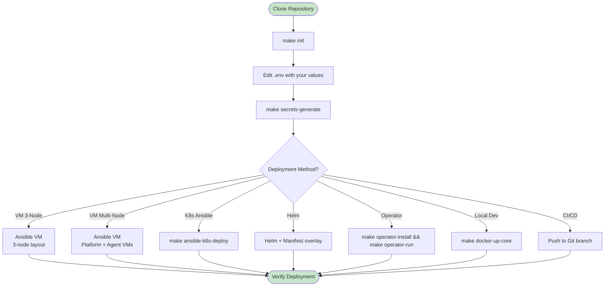
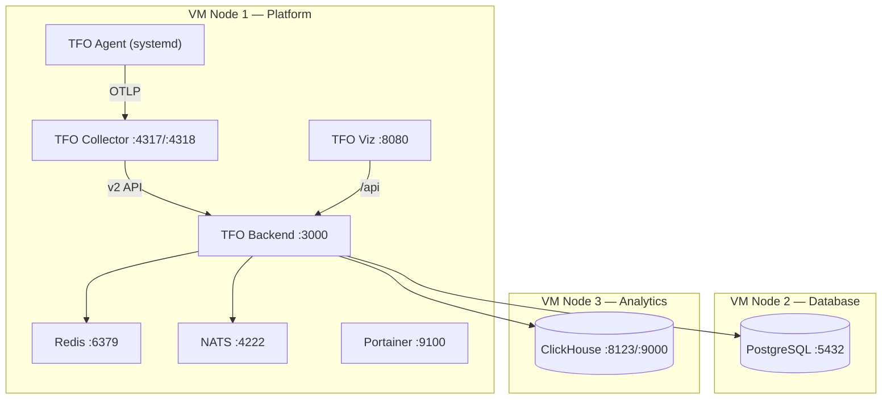
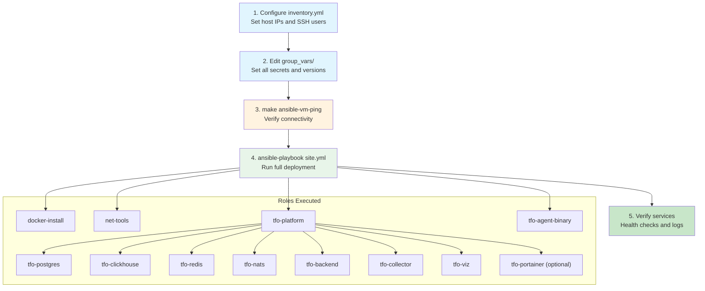
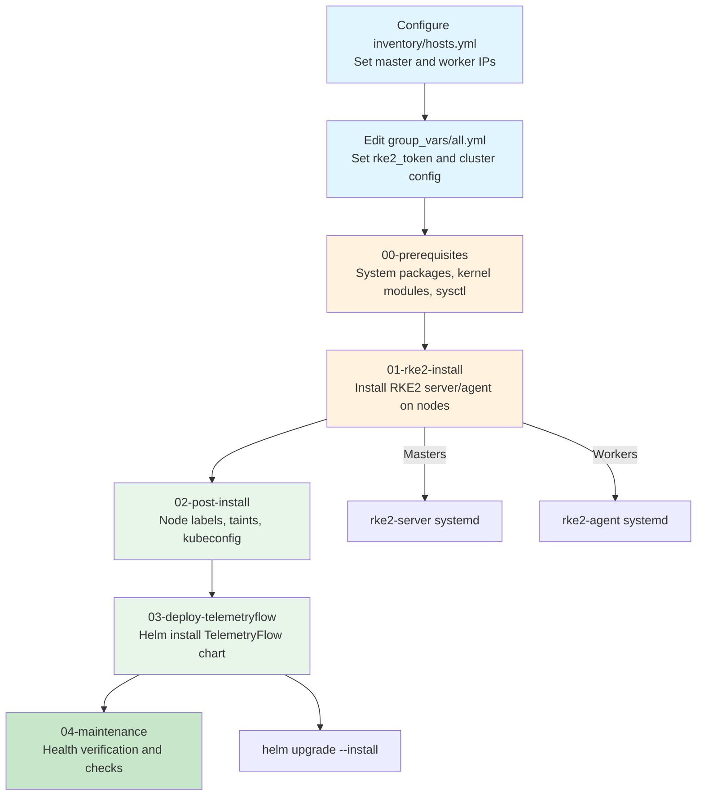
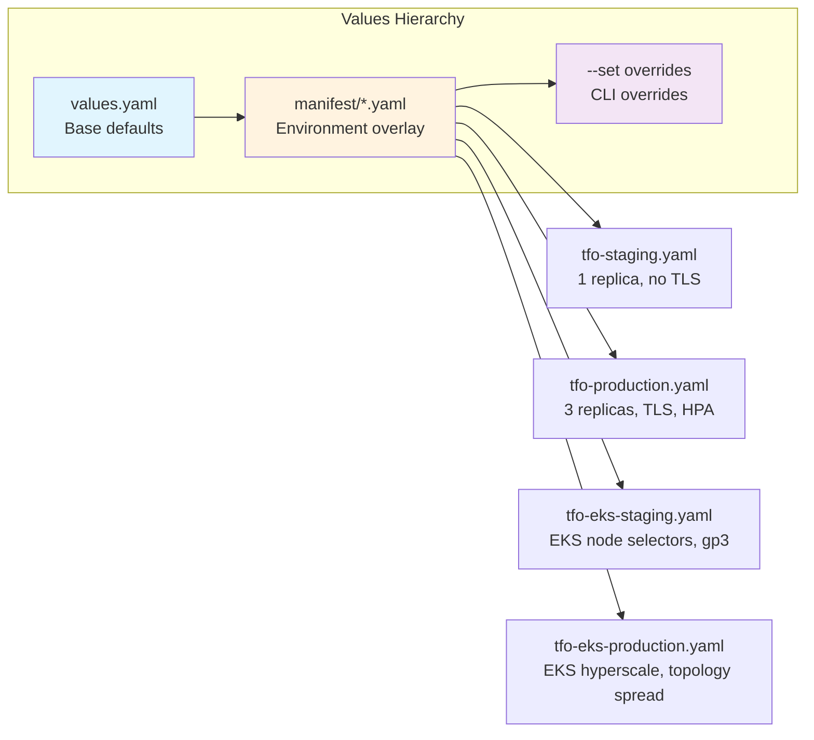

# Deployment Guide

Master guide for deploying TelemetryFlow across all supported methods.

## Prerequisites

| Tool      | Minimum Version | Purpose                       |
| --------- | --------------- | ----------------------------- |
| `kubectl` | >= 1.33         | Kubernetes cluster management |
| `helm`    | >= 3.14         | Helm chart deployment         |
| `ansible` | >= 2.16         | Infrastructure automation     |
| `docker`  | >= 24.0         | Container runtime (local/VM)  |
| `make`    | any             | Build automation              |
| `git`     | any             | Source control                |
| `openssl` | any             | Secret generation             |

Verify your environment:

```bash
make verify
```

## Quick Start



## Ansible VM Deployment

Deploys TelemetryFlow to bare-metal or VM hosts using Docker containers on a bridge network.

### 3-Node Architecture



### Deployment Flow



### Steps

```bash
# 1. Configure inventory
cp ansible/inventory.yml ansible/inventory.yml.bak
# Edit ansible/inventory.yml with your host IPs and SSH users

# 2. Set secrets in group_vars
# Edit ansible/group_vars/all.yml — set tfo_api_key_id, tfo_api_key_secret
# Edit ansible/group_vars/tfo_platform.yml — set all <CHANGE_ME> values

# 3. Test connectivity
make ansible-vm-ping

# 4. Deploy
ansible-playbook ansible/playbooks/site.yml -i ansible/inventory.yml

# 5. Deploy individual components (optional)
ansible-playbook ansible/playbooks/deploy-postgres.yml -i ansible/inventory.yml
ansible-playbook ansible/playbooks/deploy-clickhouse.yml -i ansible/inventory.yml
ansible-playbook ansible/playbooks/deploy-backend.yml -i ansible/inventory.yml
ansible-playbook ansible/playbooks/deploy-collector.yml -i ansible/inventory.yml
ansible-playbook ansible/playbooks/deploy-agent.yml -i ansible/inventory.yml
```

## Ansible K8s Deployment

Provisions an RKE2 Kubernetes cluster and deploys TelemetryFlow via Helm.



### Steps

```bash
# Full deployment
make ansible-k8s-deploy

# Or step-by-step
cd ansible-k8s
ansible-playbook playbooks/00-prerequisites.yml
ansible-playbook playbooks/01-rke2-install.yml
ansible-playbook playbooks/02-post-install.yml
ansible-playbook playbooks/03-deploy-telemetryflow.yml
ansible-playbook playbooks/04-maintenance.yml
```

## Helm Deployment

Deploy TelemetryFlow to any existing Kubernetes cluster using the Helm chart with manifest-based environment overlays.

### Manifest-Based Architecture

The chart uses a single `values.yaml` as the base, with per-environment overlay files in the `manifest/` directory:

```
helm/telemetryflow/
├── Chart.yaml
├── values.yaml                    # Base defaults
├── manifest/                      # Per-environment overlays
│   ├── tfo-staging.yaml           # Staging (on-prem / RKE2)
│   ├── tfo-production.yaml        # Production (on-prem / RKE2)
│   ├── tfo-eks-staging.yaml       # EKS staging
│   └── tfo-eks-production.yaml    # EKS production
└── templates/                     # Kubernetes manifest templates
```



### Environment Paths

| Environment    | Manifest File                      | Cluster Type   | Approval Required |
| -------------- | ---------------------------------- | -------------- | ----------------- |
| Staging        | `manifest/tfo-staging.yaml`        | On-prem / RKE2 | No (auto-deploy)  |
| Production     | `manifest/tfo-production.yaml`     | On-prem / RKE2 | Yes               |
| EKS Staging    | `manifest/tfo-eks-staging.yaml`    | AWS EKS        | No (auto-deploy)  |
| EKS Production | `manifest/tfo-eks-production.yaml` | AWS EKS        | Yes               |

### Commands

```bash
# Staging (on-prem)
helm upgrade telemetryflow ./helm/telemetryflow \
  --install \
  --namespace telemetryflow --create-namespace \
  -f values.yaml -f manifest/tfo-staging.yaml \
  --timeout 5m --wait

# Production (on-prem)
helm upgrade telemetryflow ./helm/telemetryflow \
  --install \
  --namespace telemetryflow --create-namespace \
  -f values.yaml -f manifest/tfo-production.yaml \
  --timeout 10m --wait

# EKS Staging
helm upgrade telemetryflow ./helm/telemetryflow \
  --install \
  --namespace telemetryflow --create-namespace \
  -f values.yaml -f manifest/tfo-eks-staging.yaml \
  --timeout 5m --wait

# EKS Production
helm upgrade telemetryflow ./helm/telemetryflow \
  --install \
  --namespace telemetryflow --create-namespace \
  -f values.yaml -f manifest/tfo-eks-production.yaml \
  --timeout 10m --wait

# Custom overrides
helm upgrade telemetryflow ./helm/telemetryflow \
  --install \
  --namespace telemetryflow --create-namespace \
  -f values.yaml -f manifest/tfo-staging.yaml \
  --set secrets.backend.JWT_SECRET="$(openssl rand -hex 32)" \
  --timeout 5m --wait

# Lint
make helm-lint

# Template (dry-run render)
helm template telemetryflow ./helm/telemetryflow \
  -f values.yaml -f manifest/tfo-staging.yaml

# Diff (requires helm-diff plugin)
helm diff upgrade telemetryflow ./helm/telemetryflow \
  -f values.yaml -f manifest/tfo-production.yaml
```

## Operator Deployment

Advanced deployment using the Kubernetes Operator pattern with custom resource management.

```bash
# Install CRDs
make operator-install

# Run operator locally (development)
make operator-run

# Build and deploy operator to cluster
cd operator
make docker-build IMG=telemetryflow/operator:latest
make deploy IMG=telemetryflow/operator:latest

# Uninstall
make operator-uninstall
```

## CI/CD Deployment

Automated deployment via GitHub Actions or GitLab CI/CD pipelines. Production deployments require manual approval.

- **GitHub Actions**: Environment protection rules with required reviewers
- **GitLab CI/CD**: Manual job triggers with `when: manual`

See [CI-CD-GUIDE.md](./CI-CD-GUIDE.md) for complete pipeline documentation.

```bash
# Staging: push to develop branch → auto-deploy
git push origin develop

# Production: push to main branch → approval required
git push origin main
# → Approve via GitHub Environment or GitLab Manual Job
```

## Docker Compose Local Development

```bash
# Core services only (Postgres, ClickHouse, Redis, NATS, Backend, Frontend)
make docker-up-core

# Core + monitoring (Collector, Agent)
docker compose --profile core --profile monitoring up -d

# Everything
docker compose --profile all up -d

# With built-in OTEL instrumentation
docker compose --profile all-in --profile monitoring --profile tools up -d

# Stop
make docker-down
```

## Post-Deployment Verification

### VM / Docker Compose

```bash
# Check running containers
docker ps

# Backend health
curl http://localhost:3000/health/live
curl http://localhost:3000/health/ready

# ClickHouse health
curl http://localhost:8123/ping

# NATS health
curl http://localhost:8222/healthz

# Collector health
curl http://localhost:13133/health

# Frontend
curl http://localhost:8080
```

### Kubernetes

```bash
# Check all pods
kubectl get pods -n telemetryflow -o wide

# Check services
kubectl get svc -n telemetryflow

# Backend health
kubectl port-forward svc/tfo-backend 8080:8080 -n telemetryflow &
curl http://localhost:8080/health/live

# Helm release status
helm status telemetryflow -n telemetryflow

# Check events
kubectl get events -n telemetryflow --sort-by='.lastTimestamp'

# Agent DaemonSet
kubectl get daemonset -n telemetryflow
```
