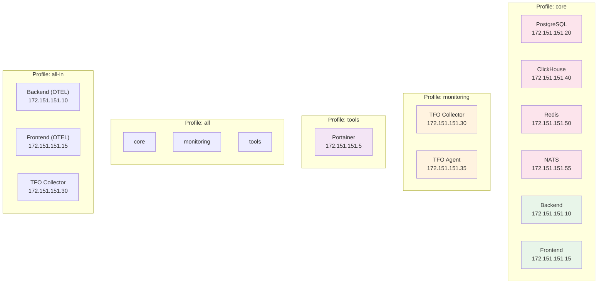
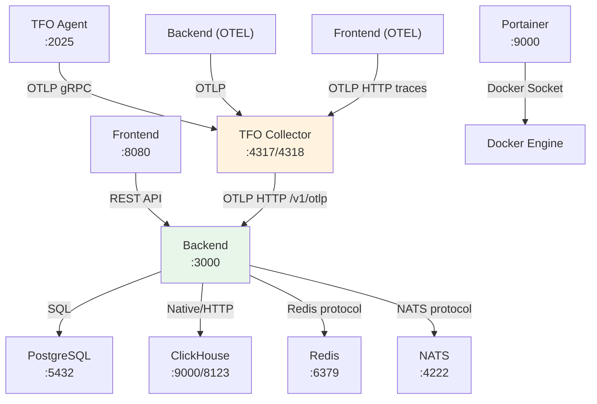
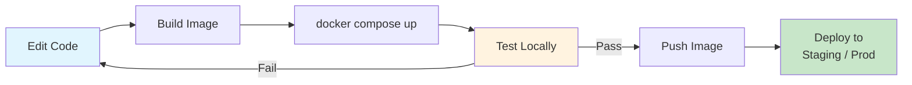

# Docker Compose Guide

Guide for running TelemetryFlow locally using Docker Compose with profile-based service selection.

## Profile Architecture



## Service Dependencies



## Quick Start

```bash
# 1. Create environment file
cp .env.example .env

# 2. Generate secrets
sed -i '' 's/^JWT_SECRET=$/JWT_SECRET='$(openssl rand -hex 32)'/' .env
sed -i '' 's/^SESSION_SECRET=$/SESSION_SECRET='$(openssl rand -hex 32)'/' .env

# 3. Start core services
docker compose --profile core up -d

# 4. Verify
docker compose ps
curl http://localhost:3000/health/live
curl http://localhost:8080
```

## Configuration via `.env`

The `.env` file controls all service configuration. Key variables:

### Core Services

| Variable               | Default                 | Description                  |
| ---------------------- | ----------------------- | ---------------------------- |
| `POSTGRES_VERSION`     | `16-alpine`             | PostgreSQL image tag         |
| `POSTGRES_DB`          | `telemetryflow`         | Database name                |
| `POSTGRES_USER`        | `telemetryflow`         | Database user                |
| `POSTGRES_PASSWORD`    | —                       | Database password (required) |
| `POSTGRES_PORT`        | `5432`                  | Host-mapped port             |
| `POSTGRES_IP`          | `172.151.151.20`        | Bridge network IP            |
| `CLICKHOUSE_VERSION`   | `latest`                | ClickHouse image tag         |
| `CLICKHOUSE_DB`        | `telemetryflow`         | Database name                |
| `CLICKHOUSE_USER`      | `default`               | User name                    |
| `CLICKHOUSE_PASSWORD`  | —                       | Password (required)          |
| `CLICKHOUSE_HTTP_PORT` | `8123`                  | HTTP interface port          |
| `CLICKHOUSE_TCP_PORT`  | `9000`                  | Native protocol port         |
| `CLICKHOUSE_IP`        | `172.151.151.40`        | Bridge network IP            |
| `REDIS_VERSION`        | `7-alpine`              | Redis image tag              |
| `REDIS_PASSWORD`       | —                       | Password (required)          |
| `REDIS_MAXMEMORY`      | `256mb`                 | Max memory limit             |
| `REDIS_IP`             | `172.151.151.50`        | Bridge network IP            |
| `NATS_VERSION`         | `2-alpine`              | NATS image tag               |
| `NATS_CLUSTER_NAME`    | `telemetryflow-cluster` | Cluster name                 |
| `NATS_IP`              | `172.151.151.55`        | Bridge network IP            |

### Application

| Variable             | Default                                | Description                   |
| -------------------- | -------------------------------------- | ----------------------------- |
| `BACKEND_IMAGE`      | `telemetryflow/telemetryflow-platform` | Backend image                 |
| `BACKEND_VERSION`    | `latest`                               | Backend version               |
| `BACKEND_PORT`       | `3000`                                 | Host-mapped port              |
| `BACKEND_IP`         | `172.151.151.10`                       | Bridge network IP             |
| `FRONTEND_IMAGE`     | `telemetryflow/telemetryflow-viz`      | Frontend image                |
| `FRONTEND_VERSION`   | `latest`                               | Frontend version              |
| `FRONTEND_PORT`      | `8080`                                 | Host-mapped port              |
| `FRONTEND_IP`        | `172.151.151.15`                       | Bridge network IP             |
| `JWT_SECRET`         | —                                      | JWT signing secret (required) |
| `SESSION_SECRET`     | —                                      | Session encryption (required) |
| `LLM_ENCRYPTION_KEY` | —                                      | LLM config encryption key     |
| `API_KEY`            | —                                      | API authentication key        |

### Monitoring

| Variable                    | Default          | Description             |
| --------------------------- | ---------------- | ----------------------- |
| `TFO_COLLECTOR_VERSION`     | `1.2.1`          | Collector image tag     |
| `TFO_COLLECTOR_IP`          | `172.151.151.30` | Bridge network IP       |
| `OTEL_GRPC_PORT`            | `4317`           | OTLP gRPC port          |
| `OTEL_HTTP_PORT`            | `4318`           | OTLP HTTP port          |
| `OTEL_METRICS_PORT`         | `8889`           | Prometheus metrics port |
| `TFO_AGENT_VERSION`         | `1.2.0`          | Agent image tag         |
| `TFO_AGENT_PORT`            | `2025`           | Agent port              |
| `TFO_AGENT_SCRAPE_INTERVAL` | `15s`            | Metrics scrape interval |

### Tools

| Variable                | Default  | Description          |
| ----------------------- | -------- | -------------------- |
| `PORTAINER_VERSION`     | `latest` | Portainer image tag  |
| `PORTAINER_PORT`        | `9000`   | Portainer HTTP port  |
| `PORTAINER_TUNNEL_PORT` | `9443`   | Portainer HTTPS port |

### Paths

| Variable            | Default     | Description                        |
| ------------------- | ----------- | ---------------------------------- |
| `VOLUMES_BASE_PATH` | `./volumes` | Base directory for persistent data |

## Common Operations

```bash
# Core services only
docker compose --profile core up -d

# Core + monitoring
docker compose --profile core --profile monitoring up -d

# Everything
docker compose --profile all up -d

# OTEL-instrumented (all-in profile)
docker compose --profile all-in --profile monitoring --profile tools up -d

# Stop all
docker compose --profile core --profile monitoring --profile tools down

# View logs
docker compose logs -f backend
docker compose logs -f tfo-collector

# Restart a service
docker compose restart backend

# Pull latest images
docker compose --profile core pull

# Check status
docker compose ps
```

## Development Workflow



### Using Custom Images

```bash
# Build a custom backend image
docker build -t telemetryflow/telemetryflow-platform:dev ./backend

# Use it in Docker Compose
BACKEND_IMAGE=telemetryflow/telemetryflow-platform \
BACKEND_VERSION=dev \
docker compose --profile core up -d
```

### Volume Management

```bash
# List volumes
docker volume ls

# Inspect a volume
docker volume inspect telemetryflow-deployment_postgres_data

# Clean up volumes (WARNING: deletes all data)
docker compose --profile core down -v
```

## Troubleshooting

| Issue                       | Diagnosis                                                    | Resolution                                  |
| --------------------------- | ------------------------------------------------------------ | ------------------------------------------- |
| Services won't start        | `docker compose logs <service>`                              | Check config, missing env vars              |
| Port conflict               | `lsof -i :<port>`                                            | Change port in `.env`                       |
| IP conflict                 | `docker network inspect telemetryflow_platform_net`          | Change subnet/IP in `.env`                  |
| Health check failing        | `docker inspect <container>` → Health section                | Check service logs, increase `start_period` |
| Volume permission error     | `ls -la volumes/`                                            | Ensure Docker has write access              |
| Agent can't reach collector | `docker exec tfo-agent wget -qO- http://172.151.151.30:4317` | Verify network, collector running           |
| Backend DB connection error | `docker logs telemetryflow-backend`                          | Check `POSTGRES_HOST`, `POSTGRES_PASSWORD`  |
| ClickHouse OOM              | `docker stats telemetryflow-clickhouse`                      | Increase Docker memory limit, add `ulimits` |
