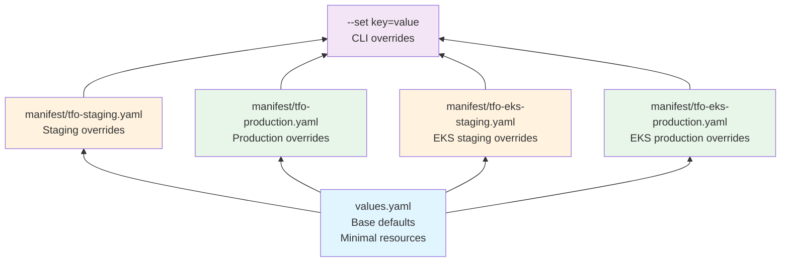
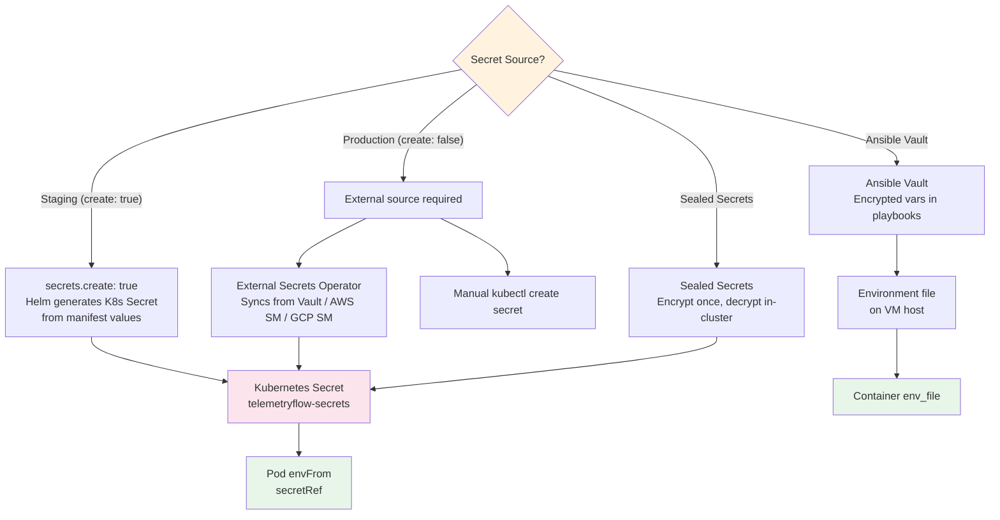

# Helm Guide

Detailed guide for deploying TelemetryFlow using the Helm chart with manifest-based environment overlays.

## Chart Structure

```
helm/telemetryflow/
├── Chart.yaml                  # Chart metadata (v1.0.0, appVersion 1.4.2)
├── values.yaml                 # Base default configuration
├── manifest/                   # Per-environment overlay files
│   ├── tfo-staging.yaml        # Staging (on-prem / RKE2)
│   ├── tfo-production.yaml     # Production (on-prem / RKE2)
│   ├── tfo-eks-staging.yaml    # EKS staging
│   └── tfo-eks-production.yaml # EKS production
└── templates/                  # Kubernetes manifest templates
    ├── namespace.yaml
    ├── secrets.yaml
    ├── configmap-env.yaml
    ├── rbac.yaml
    ├── networkpolicies.yaml
    ├── tfo-platform/
    ├── tfo-collector/
    ├── tfo-viz/
    ├── tfo-agent/
    ├── postgresql/
    ├── clickhouse/
    ├── cache-redis/
    ├── redis-master/
    ├── nats/
    ├── bullmq/
    └── exporters/
```

## Values Hierarchy

Configuration is layered — later layers override earlier ones:



## Manifest File Reference

| File                               | Environment | Cluster | Replicas | TLS | HPA | Secrets `create` |
| ---------------------------------- | ----------- | ------- | -------- | --- | --- | ---------------- |
| `manifest/tfo-staging.yaml`        | staging     | On-prem | 1        | No  | No  | `true`           |
| `manifest/tfo-production.yaml`     | production  | On-prem | 3        | Yes | Yes | `false`          |
| `manifest/tfo-eks-staging.yaml`    | staging     | AWS EKS | 1        | No  | No  | `true`           |
| `manifest/tfo-eks-production.yaml` | production  | AWS EKS | 3        | Yes | Yes | `false`          |

### Secret Management per Environment

- **Staging** (`create: true`): Helm generates K8s Secrets from manifest values. Replace `<CHANGE_ME>` placeholders.
- **Production** (`create: false`): Secrets must be pre-created via External Secrets Operator, Sealed Secrets, or manual `kubectl create secret`. This prevents accidental credential exposure.

## Secret Management Strategy



## Environment-Specific Deployment

### Staging (On-prem)

```bash
helm upgrade telemetryflow ./helm/telemetryflow \
  --install \
  --namespace telemetryflow --create-namespace \
  -f values.yaml -f manifest/tfo-staging.yaml \
  --timeout 5m --wait
```

### Production (On-prem)

```bash
# Pre-create secrets (first time only)
kubectl create secret generic telemetryflow-secrets \
  --namespace telemetryflow \
  --from-literal=JWT_SECRET="$(openssl rand -hex 32)" \
  --from-literal=SESSION_SECRET="$(openssl rand -hex 32)" \
  --from-literal=ENCRYPTION_KEY="$(openssl rand -hex 32)" \
  --from-literal=POSTGRES_PASSWORD="$(openssl rand -hex 24)" \
  --from-literal=CLICKHOUSE_PASSWORD="$(openssl rand -hex 24)"

# Deploy
helm upgrade telemetryflow ./helm/telemetryflow \
  --install \
  --namespace telemetryflow --create-namespace \
  -f values.yaml -f manifest/tfo-production.yaml \
  --timeout 10m --wait
```

### EKS Staging

```bash
helm upgrade telemetryflow ./helm/telemetryflow \
  --install \
  --namespace telemetryflow --create-namespace \
  -f values.yaml -f manifest/tfo-eks-staging.yaml \
  --timeout 5m --wait
```

### EKS Production

```bash
# Pre-create secrets (first time only)
kubectl create secret generic telemetryflow-secrets \
  --namespace telemetryflow \
  --from-literal=JWT_SECRET="$(openssl rand -hex 32)" \
  --from-literal=SESSION_SECRET="$(openssl rand -hex 32)" \
  --from-literal=ENCRYPTION_KEY="$(openssl rand -hex 32)" \
  --from-literal=POSTGRES_PASSWORD="$(openssl rand -hex 24)" \
  --from-literal=CLICKHOUSE_PASSWORD="$(openssl rand -hex 24)"

# Deploy
helm upgrade telemetryflow ./helm/telemetryflow \
  --install \
  --namespace telemetryflow --create-namespace \
  -f values.yaml -f manifest/tfo-eks-production.yaml \
  --timeout 10m --wait
```

## Environment Comparison

| Setting                     | Staging | Production         | EKS Staging | EKS Production          |
| --------------------------- | ------- | ------------------ | ----------- | ----------------------- |
| Backend replicas            | 1       | 3 (HPA 3-10)       | 1           | 3 (HPA 3-15)            |
| Collector replicas          | 1       | 2                  | 1           | 3                       |
| Viz replicas                | 1       | 2                  | 1           | 2                       |
| TLS                         | Off     | On (Let's Encrypt) | Off         | On (Let's Encrypt)      |
| PDB                         | Off     | minAvailable 2     | Off         | minAvailable 2          |
| StorageClass                | Default | Default            | gp3         | gp3                     |
| Topology Spread             | Off     | Off                | Collector   | Backend, Collector, Viz |
| Monitoring (ServiceMonitor) | Off     | Off                | On          | On                      |
| Secrets create              | `true`  | `false`            | `true`      | `false`                 |
| Init container seeds        | Enabled | Disabled           | Enabled     | Disabled                |
| Batch size                  | 8192    | 16384              | 8192        | 16384                   |
| Log level                   | info    | warn               | info        | warn                    |

## EKS-Specific Configuration

EKS manifest overlays add AWS-specific settings on top of the base chart:

- **StorageClass**: `gp3` for all persistent volumes
- **Node Selectors**: Components pinned to dedicated EKS node groups
- **Topology Spread Constraints**: Zone-aware scheduling for HA
- **Service Annotations**: NLB load balancer type
- **IAM Roles for Service Accounts (IRSA)**: Pod-level AWS permissions via annotations
- **ServiceMonitor**: Prometheus scraping enabled with label `release: prometheus`

## Configuration Reference

### Global Values

| Key                                  | Default               | Description                 |
| ------------------------------------ | --------------------- | --------------------------- |
| `global.namespace`                   | `telemetryflow`       | Kubernetes namespace        |
| `global.environment`                 | `staging`             | Environment label           |
| `global.clusterName`                 | `default`             | Cluster identifier          |
| `global.imagePullPolicy`             | `IfNotPresent`        | Container image pull policy |
| `global.domain`                      | `telemetryflow.local` | Base domain for ingress     |
| `global.tls.enabled`                 | `false`               | Enable TLS on ingress       |
| `global.ingress.className`           | `""`                  | Ingress class annotation    |
| `global.podDisruptionBudget.enabled` | `false`               | Enable PDB                  |

### TFO Agent (`tfoAgent`)

| Key                                  | Default                   | Description                      |
| ------------------------------------ | ------------------------- | -------------------------------- |
| `tfoAgent.enabled`                   | `true`                    | Deploy the agent DaemonSet       |
| `tfoAgent.mode`                      | `daemonset`               | Deployment mode (daemonset only) |
| `tfoAgent.hostNetwork`               | `true`                    | Use host network namespace       |
| `tfoAgent.hostPID`                   | `true`                    | Use host PID namespace           |
| `tfoAgent.image.repository`          | `telemetryflow/tfo-agent` | Agent image                      |
| `tfoAgent.image.tag`                 | `1.2.1`                   | Agent version                    |
| `tfoAgent.resources.requests.cpu`    | `100m`                    | CPU request                      |
| `tfoAgent.resources.requests.memory` | `128Mi`                   | Memory request                   |
| `tfoAgent.resources.limits.cpu`      | `500m`                    | CPU limit                        |
| `tfoAgent.resources.limits.memory`   | `512Mi`                   | Memory limit                     |

### TFO Collector (`tfoCollector`)

| Key                                                          | Default                           | Description             |
| ------------------------------------------------------------ | --------------------------------- | ----------------------- |
| `tfoCollector.enabled`                                       | `true`                            | Deploy the collector    |
| `tfoCollector.mode`                                          | `deployment`                      | Deployment mode         |
| `tfoCollector.replicas`                                      | `1`                               | Number of replicas      |
| `tfoCollector.image.repository`                              | `telemetryflow/tfo-collector`     | Collector image         |
| `tfoCollector.image.tag`                                     | `1.2.1`                           | Collector version       |
| `tfoCollector.config.receivers.otlp.protocols.grpc.endpoint` | `0.0.0.0:4317`                    | OTLP gRPC endpoint      |
| `tfoCollector.config.receivers.otlp.protocols.http.endpoint` | `0.0.0.0:4318`                    | OTLP HTTP endpoint      |
| `tfoCollector.config.exporters.otlphttp.endpoint`            | `http://tfo-backend:8080/v1/otlp` | Backend export endpoint |
| `tfoCollector.config.processors.batch.send_batch_size`       | `8192`                            | Batch size              |
| `tfoCollector.config.processors.batch.timeout`               | `5s`                              | Batch timeout           |

### TFO Backend (`tfoBackend`)

| Key                                              | Default                                | Description          |
| ------------------------------------------------ | -------------------------------------- | -------------------- |
| `tfoBackend.enabled`                             | `true`                                 | Deploy the backend   |
| `tfoBackend.replicas`                            | `1`                                    | Number of replicas   |
| `tfoBackend.image.repository`                    | `telemetryflow/tfo-backend`            | Backend image        |
| `tfoBackend.image.tag`                           | `1.4.2`                                | Backend version      |
| `tfoBackend.ports.http.containerPort`            | `8080`                                 | HTTP API port        |
| `tfoBackend.ports.grpc.containerPort`            | `4317`                                 | gRPC port            |
| `tfoBackend.env.DB_HOST`                         | `{{ .Release.Name }}-postgresql`       | PostgreSQL host      |
| `tfoBackend.env.CLICKHOUSE_HOST`                 | `{{ .Release.Name }}-clickhouse`       | ClickHouse host      |
| `tfoBackend.env.REDIS_CACHE_HOST`                | `{{ .Release.Name }}-cache-redis`      | Redis cache host     |
| `tfoBackend.env.NATS_URL`                        | `nats://{{ .Release.Name }}-nats:4222` | NATS URL             |
| `tfoBackend.ingress.enabled`                     | `false`                                | Enable ingress       |
| `tfoBackend.healthChecks.liveness.httpGet.path`  | `/health/live`                         | Liveness probe path  |
| `tfoBackend.healthChecks.readiness.httpGet.path` | `/health/ready`                        | Readiness probe path |

### TFO Viz (`tfoViz`)

| Key                       | Default                 | Description         |
| ------------------------- | ----------------------- | ------------------- |
| `tfoViz.enabled`          | `true`                  | Deploy the frontend |
| `tfoViz.replicas`         | `1`                     | Number of replicas  |
| `tfoViz.image.repository` | `telemetryflow/tfo-viz` | Frontend image      |
| `tfoViz.ingress.enabled`  | `false`                 | Enable ingress      |

### Infrastructure

| Key                           | Default | Description                  |
| ----------------------------- | ------- | ---------------------------- |
| `postgresql.enabled`          | `true`  | Deploy PostgreSQL            |
| `postgresql.persistence.size` | `20Gi`  | PVC size                     |
| `clickhouse.enabled`          | `true`  | Deploy ClickHouse            |
| `clickhouse.persistence.size` | `50Gi`  | PVC size                     |
| `cacheRedis.enabled`          | `true`  | Deploy Redis cache           |
| `redisMaster.enabled`         | `true`  | Deploy Redis for BullMQ      |
| `nats.enabled`                | `true`  | Deploy NATS JetStream        |
| `nats.jetstream.maxSize`      | `5Gi`   | JetStream max storage        |
| `bullmq.enabled`              | `true`  | Enable BullMQ job processing |

### Monitoring

| Key                                       | Default | Description                     |
| ----------------------------------------- | ------- | ------------------------------- |
| `monitoring.serviceMonitor.enabled`       | `false` | Create ServiceMonitor resources |
| `monitoring.exporters.redis.enabled`      | `false` | Deploy Redis exporter           |
| `monitoring.exporters.nats.enabled`       | `false` | Deploy NATS exporter            |
| `monitoring.exporters.postgres.enabled`   | `false` | Deploy PostgreSQL exporter      |
| `monitoring.exporters.clickhouse.enabled` | `false` | Deploy ClickHouse exporter      |

## Scaling and HPA

### Manual Scaling

```bash
kubectl scale deployment tfo-backend --replicas=3 -n telemetryflow
kubectl scale deployment tfo-collector --replicas=2 -n telemetryflow
```

### HPA Configuration

Configured via manifest overlays (EKS production has HPA enabled by default):

```yaml
tfoBackend:
  autoscaling:
    enabled: true
    minReplicas: 3
    maxReplicas: 10
    targetCPUUtilizationPercentage: 70
    targetMemoryUtilizationPercentage: 80
```

### Resource Recommendations by Environment

| Component     | Staging CPU/Mem | Production CPU/Mem | EKS Production CPU/Mem |
| ------------- | --------------- | ------------------ | ---------------------- |
| tfo-backend   | 250m / 512Mi    | 500m / 1Gi         | 1 / 1Gi                |
| tfo-collector | 100m / 256Mi    | 500m / 512Mi       | 1 / 1Gi                |
| tfo-agent     | 50m / 128Mi     | 100m / 256Mi       | 100m / 256Mi           |
| tfo-viz       | 100m / 128Mi    | 200m / 256Mi       | 250m / 256Mi           |
| postgresql    | 250m / 256Mi    | 1 / 1Gi            | 1 / 2Gi                |
| clickhouse    | 500m / 1Gi      | 1 / 4Gi            | 2 / 8Gi                |

## Upgrade Procedures

```bash
# 1. Check what will change
helm diff upgrade telemetryflow ./helm/telemetryflow \
  -f values.yaml -f manifest/tfo-production.yaml

# 2. Upgrade
helm upgrade telemetryflow ./helm/telemetryflow \
  -f values.yaml -f manifest/tfo-production.yaml \
  --timeout 10m --wait

# 3. Verify
helm status telemetryflow -n telemetryflow
kubectl rollout status deployment/tfo-backend -n telemetryflow
```

## Rollback Procedures

```bash
# View release history
helm history telemetryflow -n telemetryflow

# Rollback to previous revision
helm rollback telemetryflow -n telemetryflow

# Rollback to specific revision
helm rollback telemetryflow 3 -n telemetryflow

# Verify
helm status telemetryflow -n telemetryflow
```

## Troubleshooting

| Issue                | Command                                                     | Resolution                               |
| -------------------- | ----------------------------------------------------------- | ---------------------------------------- |
| Chart lint errors    | `make helm-lint`                                            | Fix YAML syntax or invalid values        |
| Pod CrashLoopBackOff | `kubectl logs <pod> -n telemetryflow`                       | Check env vars, secrets, DB connectivity |
| PVC pending          | `kubectl describe pvc <name> -n telemetryflow`              | Check StorageClass, available capacity   |
| Ingress not routing  | `kubectl describe ingress -n telemetryflow`                 | Check ingress class, DNS, TLS secret     |
| Helm install timeout | `helm install ... --timeout 10m`                            | Increase timeout, check init containers  |
| Values not applied   | `helm get values telemetryflow -n telemetryflow --all`      | Verify merged values                     |
| Secrets missing      | `kubectl get secret telemetryflow-secrets -n telemetryflow` | Pre-create secrets (production)          |
| EBS stuck on EKS     | `kubectl describe pvc <name> -n telemetryflow`              | Check gp3 StorageClass, AZ constraints   |
