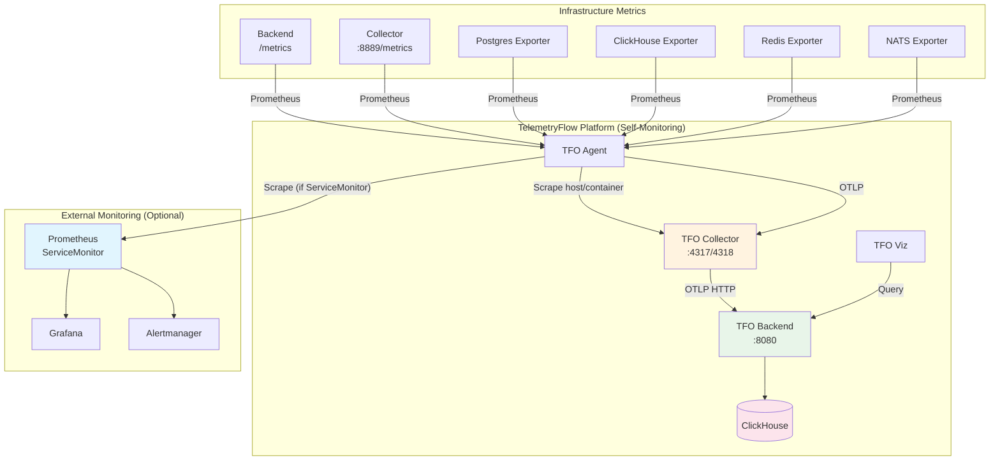

# Monitoring Guide

Guide for monitoring the TelemetryFlow platform itself — health checks, metrics, logging, and alerting.

## Monitoring Architecture

TelemetryFlow is an observability platform that can also monitor itself (self-monitoring). The TFO Agent collects platform metrics, the Collector processes them, and the Backend stores them in ClickHouse for visualization in TFO Viz.



## Health Check Endpoints

### Application Services

| Service       | Endpoint        | Method | Expected | Interval | Purpose                          |
| ------------- | --------------- | ------ | -------- | -------- | -------------------------------- |
| TFO Backend   | `/health/live`  | GET    | 200      | 15s      | Liveness — process is alive      |
| TFO Backend   | `/health/ready` | GET    | 200      | 10s      | Readiness — can serve traffic    |
| TFO Collector | `:13133/health` | GET    | 200      | 10s      | Collector health check extension |
| TFO Agent     | `:13133/`       | GET    | 200      | 15s      | Agent health check               |
| TFO Viz       | `/`             | GET    | 200      | 15s      | Frontend serving                 |

### Infrastructure Services

| Service    | Endpoint                       | Method | Expected | Purpose                        |
| ---------- | ------------------------------ | ------ | -------- | ------------------------------ |
| PostgreSQL | `pg_isready -U <user> -d <db>` | Exec   | exit 0   | Database accepting connections |
| ClickHouse | `:8123/ping`                   | GET    | `Ok.`    | Server responding              |
| Redis      | `redis-cli -a <pass> ping`     | Exec   | `PONG`   | Server responding              |
| NATS       | `:8222/healthz`                | GET    | 200      | JetStream healthy              |

### Docker Compose Health Checks

All infrastructure services in Docker Compose have built-in health checks:

```yaml
postgres:
  healthcheck:
    test: ["CMD-SHELL", "pg_isready -U telemetryflow -d telemetryflow"]
    interval: 10s
    timeout: 5s
    retries: 5
    start_period: 30s

clickhouse:
  healthcheck:
    test: ["CMD-SHELL", "wget --spider --tries 1 http://localhost:8123/ping"]
    interval: 10s
    timeout: 5s
    retries: 5
    start_period: 30s

redis:
  healthcheck:
    test: ["CMD", "redis-cli", "-a", "${REDIS_PASSWORD}", "ping"]
    interval: 10s
    timeout: 5s
    retries: 5
    start_period: 15s

nats:
  healthcheck:
    test: ["CMD-SHELL", "wget --spider --tries 1 http://localhost:8222/healthz"]
    interval: 10s
    timeout: 5s
    retries: 5
    start_period: 15s
```

## Metrics Endpoints

| Service             | Endpoint        | Format     | Description                                                 |
| ------------------- | --------------- | ---------- | ----------------------------------------------------------- |
| TFO Collector       | `:8889/metrics` | Prometheus | Collector pipeline metrics (spans, metrics, logs processed) |
| TFO Backend         | `/metrics`      | Prometheus | Application metrics (request rate, latency, errors)         |
| TFO Agent           | `:2025/metrics` | Prometheus | Agent collection metrics                                    |
| PostgreSQL Exporter | `:9187/metrics` | Prometheus | Database metrics (connections, replication, locks)          |
| ClickHouse Exporter | `:9090/metrics` | Prometheus | Database metrics (queries, parts, merges)                   |
| Redis Exporter      | `:9121/metrics` | Prometheus | Cache metrics (hits, misses, memory, connections)           |
| NATS Exporter       | `:7777/metrics` | Prometheus | JetStream metrics (messages, bytes, consumers)              |

### Key Metrics to Monitor

| Metric                                 | Source     | Alert Threshold                 |
| -------------------------------------- | ---------- | ------------------------------- |
| `otelcol_receiver_accepted_spans`      | Collector  | Sustained zero = pipeline issue |
| `otelcol_exporter_sent_spans`          | Collector  | Sustained zero = export failure |
| `otelcol_processor_refused_spans`      | Collector  | > 0 = processor overloaded      |
| `otelcol_processor_dropped_spans`      | Collector  | > 0 = dropping data             |
| `http_server_request_duration_seconds` | Backend    | p99 > 5s                        |
| `http_server_active_requests`          | Backend    | Sustained high = overload       |
| `pg_stat_activity_count`               | PostgreSQL | Near `max_connections`          |
| `clickhouse_queries`                   | ClickHouse | High error rate                 |
| `redis_connected_clients`              | Redis      | Near `maxclients`               |
| `redis_used_memory`                    | Redis      | Near `maxmemory`                |
| `nats_jetstream_messages`              | NATS       | Unbounded growth = consumer lag |

## Log Aggregation

### Docker Compose

```bash
# View all logs
docker compose logs -f

# Specific service logs
docker compose logs -f backend
docker compose logs -f tfo-collector
docker compose logs -f tfo-agent

# Last 100 lines
docker compose logs --tail 100 backend

# With timestamps
docker compose logs -t backend

# Logs are stored in volumes
ls volumes/backend/logs/
ls volumes/clickhouse/logs/
```

### Kubernetes

```bash
# Pod logs
kubectl logs -f deployment/tfo-backend -n telemetryflow
kubectl logs -f deployment/tfo-collector -n telemetryflow

# DaemonSet logs (agent on specific node)
kubectl logs -f daemonset/tfo-agent -n telemetryflow

# Previous container (crash)
kubectl logs deployment/tfo-backend --previous -n telemetryflow

# All pods with label
kubectl logs -l app=tfo-backend -n telemetryflow --all-containers
```

### Structured Logging

TelemetryFlow services output structured JSON logs:

```json
{
  "timestamp": "2026-05-30T12:00:00.000Z",
  "level": "info",
  "service": "tfo-backend",
  "message": "Request processed",
  "method": "GET",
  "path": "/api/v1/metrics",
  "statusCode": 200,
  "durationMs": 45
}
```

## Alerting Configuration

### Kubernetes Probes (Built-in)

```yaml
# Already configured in Helm values
tfoBackend:
  healthChecks:
    liveness:
      enabled: true
      httpGet:
        path: /health/live
        port: http
      initialDelaySeconds: 30
      periodSeconds: 15
      failureThreshold: 3
    readiness:
      enabled: true
      httpGet:
        path: /health/ready
        port: http
      initialDelaySeconds: 10
      periodSeconds: 10
      failureThreshold: 3
    startup:
      enabled: true
      httpGet:
        path: /health/live
        port: http
      initialDelaySeconds: 5
      failureThreshold: 30
```

### Prometheus Alert Rules (Example)

```yaml
apiVersion: monitoring.coreos.com/v1
kind: PrometheusRule
metadata:
  name: telemetryflow-alerts
  namespace: telemetryflow
spec:
  groups:
    - name: telemetryflow
      rules:
        - alert: TelemetryFlowBackendDown
          expr: up{job="tfo-backend"} == 0
          for: 2m
          labels:
            severity: critical
          annotations:
            summary: "TFO Backend is down"
            description: "Backend has been unreachable for 2 minutes"

        - alert: TelemetryFlowCollectorDroppingSpans
          expr: rate(otelcol_processor_dropped_spans[5m]) > 0
          for: 5m
          labels:
            severity: warning
          annotations:
            summary: "Collector dropping spans"

        - alert: TelemetryFlowPostgresConnectionsHigh
          expr: pg_stat_activity_count > 80
          for: 5m
          labels:
            severity: warning
          annotations:
            summary: "PostgreSQL connections approaching limit"

        - alert: TelemetryFlowClickHouseDiskSpace
          expr: clickhouse_disk_space_available_bytes < 10737418240
          for: 5m
          labels:
            severity: critical
          annotations:
            summary: "ClickHouse less than 10GB free"

        - alert: TelemetryFlowRedisMemoryHigh
          expr: redis_used_memory_bytes / redis_memory_max_bytes > 0.9
          for: 5m
          labels:
            severity: warning
          annotations:
            summary: "Redis using > 90% of max memory"
```

### Enabling ServiceMonitors

```yaml
# In Helm values
monitoring:
  serviceMonitor:
    enabled: true
    interval: 30s
    scrapeTimeout: 10s
    honorLabels: true

  exporters:
    redis:
      enabled: true
    nats:
      enabled: true
    postgres:
      enabled: true
    clickhouse:
      enabled: true
```

## Dashboard Setup

### TFO Viz (Built-in)

Access the built-in dashboard at `http://localhost:8080` (or your configured URL). It provides:

- Infrastructure overview (hosts, containers, pods)
- Application performance metrics
- Log search and filtering
- Distributed trace visualization
- Alert management

### Grafana (External)

If using an external Prometheus + Grafana stack:

1. Add Prometheus data sources for each exporter endpoint
2. Import dashboards or create custom panels for:
   - Backend request rate, latency, error rate
   - Collector pipeline throughput and drops
   - Database performance and connections
   - Cache hit rates and memory usage
   - NATS consumer lag
