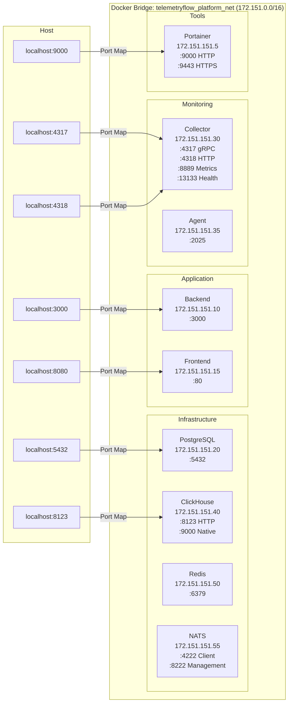
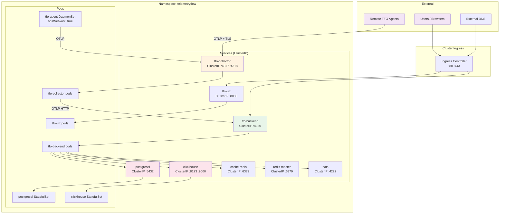
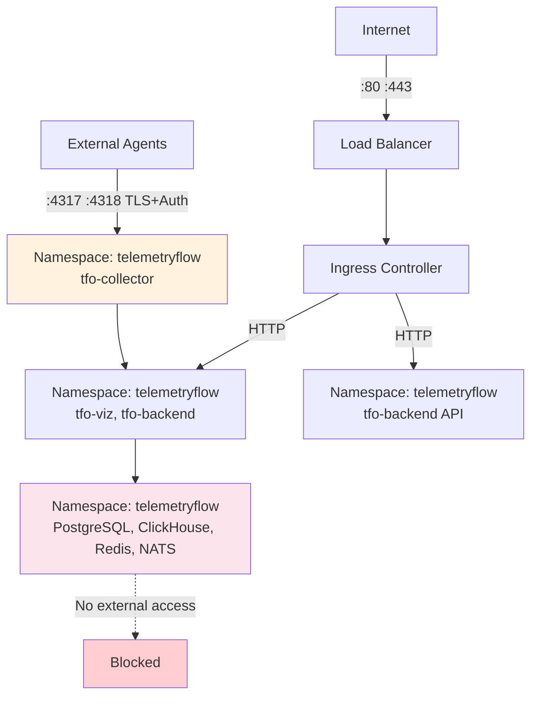

# Networking Guide

Network architecture for TelemetryFlow across Docker Compose and Kubernetes deployments.

## Docker Network Diagram

All Docker Compose services share a bridge network (`telemetryflow_platform_net`) with fixed IPs in the `172.151.0.0/16` subnet.



## Kubernetes Networking Diagram



## Port Reference Table

### Application Ports

| Port  | Protocol | Service                         | Internal/External                  | Description             |
| ----- | -------- | ------------------------------- | ---------------------------------- | ----------------------- |
| 80    | HTTP     | TFO Viz (via Ingress)           | External                           | Frontend dashboard      |
| 443   | HTTPS    | TFO Viz / Backend (via Ingress) | External                           | TLS frontend + API      |
| 3000  | HTTP     | TFO Backend                     | External (Docker) / Internal (K8s) | REST API server         |
| 8080  | HTTP     | TFO Backend (K8s)               | Internal                           | Container port (K8s)    |
| 80    | HTTP     | TFO Viz container               | Internal                           | Frontend container port |
| 2025  | HTTP     | TFO Agent                       | External (Docker)                  | Agent status/metrics    |
| 4317  | gRPC     | TFO Collector                   | Agents                             | OTLP gRPC receiver      |
| 4318  | HTTP     | TFO Collector                   | Agents                             | OTLP HTTP receiver      |
| 8889  | HTTP     | TFO Collector                   | Internal                           | Prometheus metrics      |
| 13133 | HTTP     | TFO Collector / Agent           | Internal                           | Health check            |

### Infrastructure Ports

| Port | Protocol | Service    | Internal/External | Description              |
| ---- | -------- | ---------- | ----------------- | ------------------------ |
| 5432 | TCP      | PostgreSQL | Internal          | PostgreSQL wire protocol |
| 8123 | HTTP     | ClickHouse | Internal          | HTTP interface           |
| 9000 | TCP      | ClickHouse | Internal          | Native protocol          |
| 6379 | TCP      | Redis      | Internal          | Redis protocol           |
| 4222 | TCP      | NATS       | Internal          | Client connections       |
| 8222 | HTTP     | NATS       | Internal          | Management/monitoring    |

### Tooling Ports

| Port | Protocol | Service   | Internal/External | Description              |
| ---- | -------- | --------- | ----------------- | ------------------------ |
| 9000 | HTTP     | Portainer | External (Docker) | Container management UI  |
| 9443 | HTTPS    | Portainer | External (Docker) | Container management TLS |

### Kubernetes Cluster Ports

| Port  | Protocol | Service            | Direction     | Description               |
| ----- | -------- | ------------------ | ------------- | ------------------------- |
| 6443  | TCP      | Kubernetes API     | Inbound       | API server                |
| 9345  | TCP      | RKE2 Server        | Inbound       | RKE2 server communication |
| 2379  | TCP      | etcd               | Intra-cluster | etcd client               |
| 2380  | TCP      | etcd               | Intra-cluster | etcd peer                 |
| 10250 | TCP      | kubelet            | Intra-cluster | Kubelet API               |
| 8472  | UDP      | Canal/VXLAN        | Intra-cluster | Pod overlay network       |
| 51820 | UDP      | WireGuard (Cilium) | Intra-cluster | Encrypted overlay         |

## Ingress Configuration

### Basic Ingress (Staging)

```yaml
# Helm values override
tfoViz:
  ingress:
    enabled: true
    className: "nginx"
    host: telemetryflow.staging.example.com
    tls: false
```

### TLS Ingress (Production)

```yaml
tfoViz:
  ingress:
    enabled: true
    className: "nginx"
    annotations:
      cert-manager.io/cluster-issuer: letsencrypt-prod
      nginx.ingress.kubernetes.io/ssl-redirect: "true"
      nginx.ingress.kubernetes.io/rate-limit: "100"
    tls: true
    tlsSecretName: telemetryflow-viz-tls
    host: telemetryflow.example.com

tfoBackend:
  ingress:
    enabled: true
    className: "nginx"
    annotations:
      cert-manager.io/cluster-issuer: letsencrypt-prod
    tls: true
    tlsSecretName: telemetryflow-backend-tls
    host: api.telemetryflow.example.com
```

### Collector Ingress (Agent Traffic)

```yaml
# Separate ingress for OTLP receiver
apiVersion: networking.k8s.io/v1
kind: Ingress
metadata:
  name: tfo-collector
  namespace: telemetryflow
  annotations:
    nginx.ingress.kubernetes.io/backend-protocol: "GRPC"
    nginx.ingress.kubernetes.io/ssl-passthrough: "true"
spec:
  ingressClassName: nginx
  tls:
    - hosts:
        - otlp.telemetryflow.example.com
      secretName: telemetryflow-collector-tls
  rules:
    - host: otlp.telemetryflow.example.com
      http:
        paths:
          - path: /
            pathType: Prefix
            backend:
              service:
                name: tfo-collector
                port:
                  number: 4317
```

## DNS Configuration

### Kubernetes Internal

CoreDNS resolves services within the cluster:

```
tfo-backend.telemetryflow.svc.cluster.local
tfo-collector.telemetryflow.svc.cluster.local
tfo-viz.telemetryflow.svc.cluster.local
postgresql.telemetryflow.svc.cluster.local
clickhouse.telemetryflow.svc.cluster.local
cache-redis.telemetryflow.svc.cluster.local
redis-master.telemetryflow.svc.cluster.local
nats.telemetryflow.svc.cluster.local
```

Short names work within the same namespace:

```
tfo-backend:8080
tfo-collector:4317
postgresql:5432
clickhouse:8123
```

### External DNS

For production, configure external DNS to resolve ingress hosts:

```
telemetryflow.example.com       → Ingress LB IP
api.telemetryflow.example.com   → Ingress LB IP
otlp.telemetryflow.example.com  → Ingress LB IP
```

## Firewall Requirements

### Docker Compose (VM)

| Direction | Port | Source | Destination | Purpose            |
| --------- | ---- | ------ | ----------- | ------------------ |
| Inbound   | 80   | All    | Host        | Frontend HTTP      |
| Inbound   | 443  | All    | Host        | Frontend/API HTTPS |
| Inbound   | 3000 | Admin  | Host        | Backend API (dev)  |
| Inbound   | 4317 | Agents | Host        | OTLP gRPC          |
| Inbound   | 4318 | Agents | Host        | OTLP HTTP          |
| Inbound   | 22   | Admin  | Host        | SSH (Ansible)      |

### Kubernetes Cluster

| Direction | Port       | Source         | Destination | Purpose             |
| --------- | ---------- | -------------- | ----------- | ------------------- |
| Inbound   | 6443       | Admin, Masters | Masters     | Kubernetes API      |
| Inbound   | 9345       | Workers        | Masters     | RKE2 server         |
| Inbound   | 80         | All            | LB/Ingress  | HTTP                |
| Inbound   | 443        | All            | LB/Ingress  | HTTPS               |
| Intra     | 2379, 2380 | Masters        | Masters     | etcd                |
| Intra     | 10250      | All nodes      | All nodes   | kubelet             |
| Intra     | 8472/UDP   | All nodes      | All nodes   | Canal VXLAN overlay |
| Intra     | 30000      | Masters        | Masters     | etcd metrics        |

### Network Isolation Recommendations


