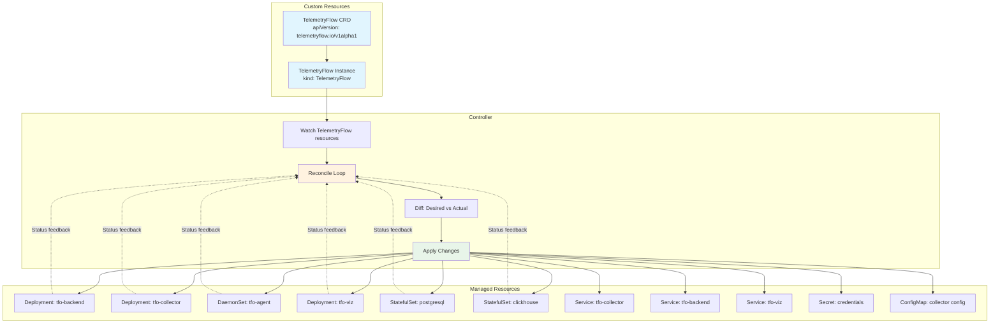
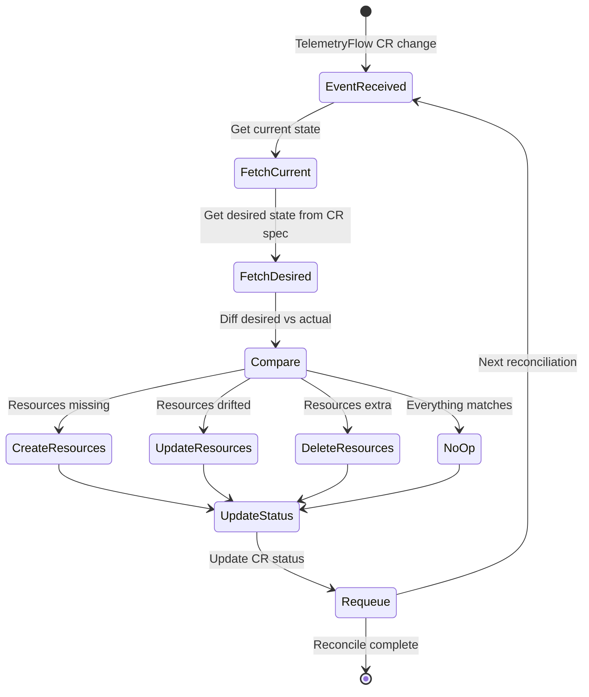

# Operator Guide

Guide for the TelemetryFlow Kubernetes Operator — a custom controller that manages TelemetryFlow deployments using custom resource definitions (CRDs).

## Operator Architecture

The operator follows the Kubernetes Operator pattern using Kubebuilder (v4). It watches `TelemetryFlow` custom resources and reconciles the desired state against the actual cluster state.



## Reconciliation Loop



## TelemetryFlow CRD Reference

### Spec Fields

| Field                               | Type   | Required | Default                             | Description                |
| ----------------------------------- | ------ | -------- | ----------------------------------- | -------------------------- |
| `spec.backend.enabled`              | bool   | no       | `true`                              | Deploy TFO Backend         |
| `spec.backend.replicas`             | int    | no       | `1`                                 | Backend replicas           |
| `spec.backend.image`                | string | no       | `telemetryflow/tfo-backend:1.4.0`   | Backend image              |
| `spec.backend.resources`            | object | no       | —                                   | Resource requests/limits   |
| `spec.collector.enabled`            | bool   | no       | `true`                              | Deploy TFO Collector       |
| `spec.collector.replicas`           | int    | no       | `1`                                 | Collector replicas         |
| `spec.collector.image`              | string | no       | `telemetryflow/tfo-collector:1.4.0` | Collector image            |
| `spec.agent.enabled`                | bool   | no       | `true`                              | Deploy TFO Agent DaemonSet |
| `spec.agent.image`                  | string | no       | `telemetryflow/tfo-agent:1.4.0`     | Agent image                |
| `spec.viz.enabled`                  | bool   | no       | `true`                              | Deploy TFO Viz frontend    |
| `spec.viz.replicas`                 | int    | no       | `1`                                 | Frontend replicas          |
| `spec.viz.image`                    | string | no       | `telemetryflow/tfo-viz:1.4.0`       | Frontend image             |
| `spec.postgresql.enabled`           | bool   | no       | `true`                              | Deploy PostgreSQL          |
| `spec.clickhouse.enabled`           | bool   | no       | `true`                              | Deploy ClickHouse          |
| `spec.redis.enabled`                | bool   | no       | `true`                              | Deploy Redis cache         |
| `spec.nats.enabled`                 | bool   | no       | `true`                              | Deploy NATS JetStream      |
| `spec.ingress.enabled`              | bool   | no       | `false`                             | Create Ingress resources   |
| `spec.ingress.host`                 | string | no       | `""`                                | Ingress hostname           |
| `spec.ingress.tls`                  | bool   | no       | `false`                             | Enable TLS                 |
| `spec.secrets.backendJWTSecret`     | string | yes      | —                                   | JWT signing secret         |
| `spec.secrets.backendSessionSecret` | string | yes      | —                                   | Session encryption secret  |
| `spec.secrets.postgresPassword`     | string | yes      | —                                   | PostgreSQL password        |
| `spec.secrets.clickhousePassword`   | string | yes      | —                                   | ClickHouse password        |

### Status Fields

| Field                   | Type   | Description                                                  |
| ----------------------- | ------ | ------------------------------------------------------------ |
| `status.phase`          | string | Current phase (`Pending`, `Deploying`, `Ready`, `Error`)     |
| `status.conditions`     | array  | Condition objects with `type`, `status`, `reason`, `message` |
| `status.backendReady`   | bool   | Backend deployment is ready                                  |
| `status.collectorReady` | bool   | Collector deployment is ready                                |
| `status.datastoreReady` | bool   | All datastore pods are ready                                 |

## Installation

### Prerequisites

- Kubernetes >= 1.33
- kubectl configured with cluster access
- Go >= 1.26 (for building from source)

### Install CRDs

```bash
# From repository root
make operator-install

# Or directly
cd operator
make install
```

### Deploy the Operator

```bash
# Run locally (development)
make operator-run

# Build and deploy to cluster
cd operator
make docker-build IMG=telemetryflow/operator:latest
make deploy IMG=telemetryflow/operator:latest
```

### Uninstall

```bash
make operator-uninstall
# Or:
cd operator
make undeploy
make uninstall
```

## Example Usage

### Minimal Deployment

```yaml
apiVersion: telemetryflow.io/v1alpha1
kind: TelemetryFlow
metadata:
  name: telemetryflow-demo
  namespace: telemetryflow
spec:
  backend:
    enabled: true
    replicas: 1
  collector:
    enabled: true
  agent:
    enabled: true
  viz:
    enabled: true
  postgresql:
    enabled: true
  clickhouse:
    enabled: true
  secrets:
    backendJWTSecret: "<generated-secret>"
    backendSessionSecret: "<generated-secret>"
    postgresPassword: "<generated-secret>"
    clickhousePassword: "<generated-secret>"
```

### Production Deployment

```yaml
apiVersion: telemetryflow.io/v1alpha1
kind: TelemetryFlow
metadata:
  name: telemetryflow-prod
  namespace: telemetryflow
spec:
  backend:
    enabled: true
    replicas: 3
    image: "telemetryflow/tfo-backend:1.4.0"
    resources:
      requests:
        cpu: "1"
        memory: 2Gi
      limits:
        cpu: "2"
        memory: 4Gi
  collector:
    enabled: true
    replicas: 2
    resources:
      requests:
        cpu: "1"
        memory: 1Gi
      limits:
        cpu: "2"
        memory: 2Gi
  agent:
    enabled: true
  viz:
    enabled: true
    replicas: 2
  postgresql:
    enabled: true
    persistence:
      size: 50Gi
  clickhouse:
    enabled: true
    persistence:
      size: 200Gi
  ingress:
    enabled: true
    host: telemetryflow.example.com
    tls: true
  secrets:
    backendJWTSecret: "<generated-secret>"
    backendSessionSecret: "<generated-secret>"
    postgresPassword: "<generated-secret>"
    clickhousePassword: "<generated-secret>"
```

Apply:

```bash
kubectl apply -f telemetryflow-instance.yaml
```

### Check Status

```bash
# View the instance
kubectl get telemetryflow -n telemetryflow

# Detailed status
kubectl describe telemetryflow telemetryflow-prod -n telemetryflow

# View managed resources
kubectl get all -n telemetryflow
```

## Development Guide

### Project Structure

```
operator/
├── Makefile          # Build, test, deploy targets
├── PROJECT           # Kubebuilder project metadata
├── go.mod            # Go module (requires Go >= 1.26)
├── api/
│   └── v1alpha1/     # CRD type definitions (Go structs)
├── internal/
│   └── controller/   # Reconciliation controller logic + envtest suite
├── test/
│   └── e2e/          # End-to-end tests (requires real cluster)
│       ├── e2e_suite_test.go   # Suite setup, kubeconfig, namespace lifecycle
│       ├── e2e_test.go         # Test cases: full deploy, minimal, deletion, update
│       └── README.md           # E2E testing guide
└── config/
    ├── crd/          # Generated CRD manifests
    ├── manager/      # Controller manager deployment
    ├── rbac/         # Role and RoleBinding manifests
    └── samples/      # Example CR instances
```

### Development Workflow

```bash
cd operator

# Generate CRD manifests and deepcopy methods
make generate-manifests

# Run unit tests (envtest, no cluster needed)
make test

# Run e2e tests (requires operator deployed on a real cluster)
make test-e2e

# Run linter
make lint

# Run locally against a cluster
make run

# Build binary
make build
```

### Adding a New Field

1. Add the field to the API type in `api/v1alpha1/telemetryflow_types.go`
2. Run `make generate-manifests` to update CRDs and deepcopy methods
3. Update the controller logic in `internal/controller/`
4. Add/update envtest unit tests in `internal/controller/suite_test.go`
5. Add/update e2e tests in `test/e2e/e2e_test.go`
6. Run `make test` to verify unit tests
7. Run `make test-e2e` to verify against a real cluster

### Test Strategy

| Suite          | Location               | Command         | Requires Cluster |
| -------------- | ---------------------- | --------------- | ---------------- |
| Unit (envtest) | `internal/controller/` | `make test`     | No               |
| E2E            | `test/e2e/`            | `make test-e2e` | Yes              |

E2E test cases cover:

- **Full platform deployment** — All components deployed, status reaches Ready
- **Minimal deployment** — Only backend + PostgreSQL, agent disabled
- **Deletion and cleanup** — CR deletion triggers garbage collection of all managed resources
- **Update and reconciliation** — Spec changes (e.g., replica count) are reflected in managed resources

## Customization

The operator can be customized via:

- **CR spec fields**: Control component enablement, replicas, images, resources
- **Kustomize overlays**: Overlay additional patches on top of the default installation
- **Environment variables**: Set operator-level configuration via the manager Deployment
