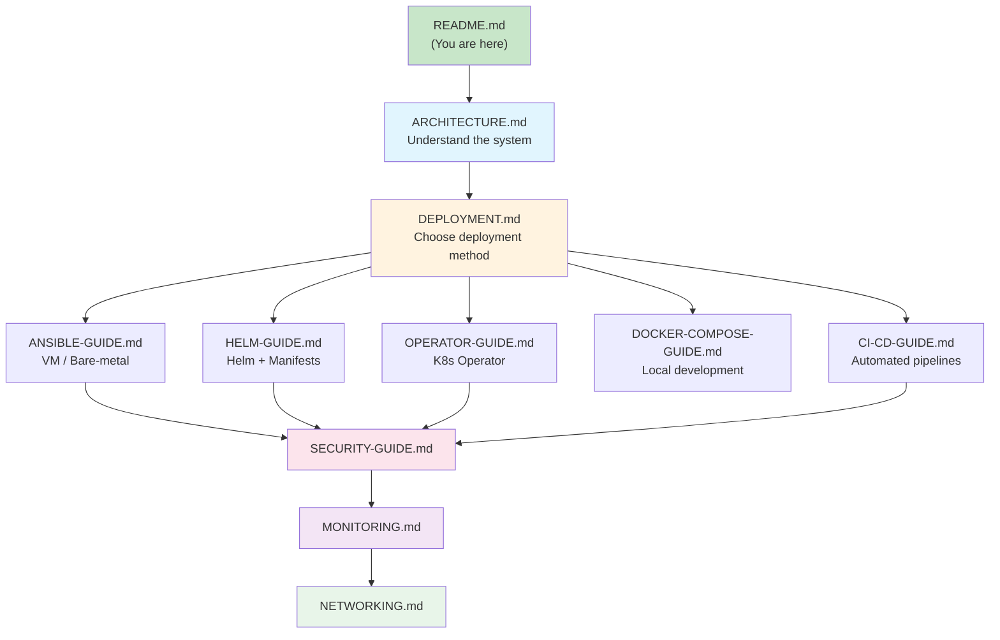

# TelemetryFlow Deployment Documentation

Comprehensive documentation for deploying and operating the TelemetryFlow observability platform.

## Documentation Index

| Document                                             | Description                                                         |
| ---------------------------------------------------- | ------------------------------------------------------------------- |
| [ARCHITECTURE.md](./ARCHITECTURE.md)                 | System architecture, data flow, VM and Kubernetes topology diagrams |
| [DEPLOYMENT.md](./DEPLOYMENT.md)                     | Master deployment guide covering all methods                        |
| [ANSIBLE-GUIDE.md](./ANSIBLE-GUIDE.md)               | Ansible playbooks for VM and Kubernetes cluster provisioning        |
| [HELM-GUIDE.md](./HELM-GUIDE.md)                     | Helm chart, manifest overlays, and environment lifecycle management |
| [OPERATOR-GUIDE.md](./OPERATOR-GUIDE.md)             | Kubernetes Operator pattern, CRDs, and reconciliation               |
| [DOCKER-COMPOSE-GUIDE.md](./DOCKER-COMPOSE-GUIDE.md) | Docker Compose profiles for local development and testing           |
| [CI-CD-GUIDE.md](./CI-CD-GUIDE.md)                   | GitHub Actions and GitLab CI/CD pipelines with approval mechanisms  |
| [SECURITY-GUIDE.md](./SECURITY-GUIDE.md)             | Secret management, TLS, network policies, and security checklists   |
| [MONITORING.md](./MONITORING.md)                     | Health checks, metrics, logging, and alerting configuration         |
| [NETWORKING.md](./NETWORKING.md)                     | Docker networks, Kubernetes services, port reference, and DNS       |

## Quick Links

- [Contributing Guide](../CONTRIBUTING.md)
- [Security Policy](../SECURITY.md)
- [Changelog](../CHANGELOG.md)
- [License](../LICENSE)

## Documentation Reading Order

## Deployment Methods at a Glance

| Method             | Target                  | Tooling               | Best For                         |
| ------------------ | ----------------------- | --------------------- | -------------------------------- |
| **Ansible VM**     | Bare-metal / VM hosts   | Ansible + Docker      | 3-node or multi-node VM clusters |
| **Ansible K8s**    | RKE2 Kubernetes cluster | Ansible + RKE2 + Helm | Full K8s cluster from scratch    |
| **Helm**           | Any Kubernetes cluster  | Helm + Manifests      | Cloud K8s (EKS, GKE, AKS, RKE2)  |
| **Operator**       | Any Kubernetes cluster  | Kubebuilder Operator  | GitOps / CRD-driven deployments  |
| **Docker Compose** | Local development       | Docker Compose        | Development, testing, evaluation |
