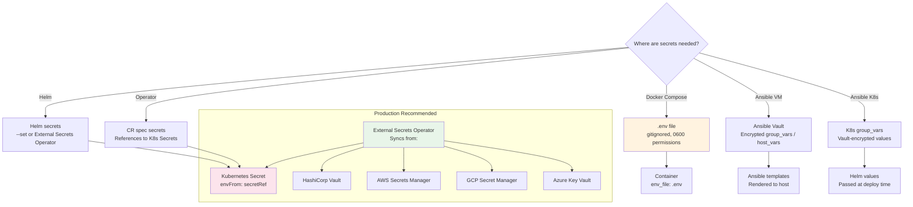
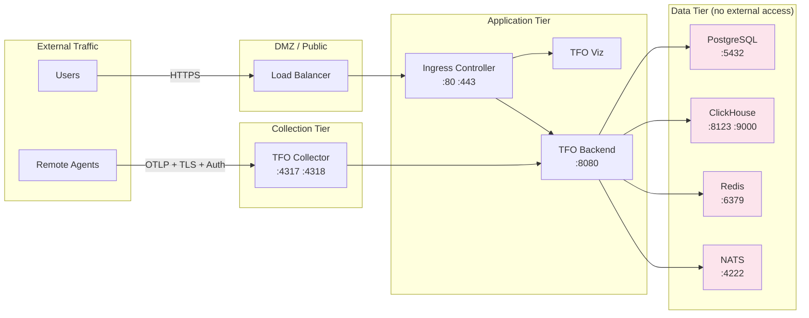

# Security Guide

Security best practices and procedures for TelemetryFlow deployments. **NEVER commit real credentials to the repository.**

## Secret Management Overview



## Secret Rotation Procedures

### Generate New Secrets

```bash
make secrets-generate
```

This outputs randomly generated values using `openssl rand`:

```
POSTGRES_PASSWORD=<64-char-hex>
CLICKHOUSE_PASSWORD=<64-char-hex>
REDIS_PASSWORD=<64-char-hex>
NATS_PASSWORD=<64-char-hex>
JWT_SECRET=<64-char-hex>
```

### Docker Compose Rotation

```bash
# 1. Generate new secrets
make secrets-generate

# 2. Update .env with new values
# 3. Restart affected services
docker compose --profile core down
docker compose --profile core up -d
```

### Kubernetes / Helm Rotation

```bash
# 1. Update the secret values
kubectl create secret generic telemetryflow-secrets \
  --namespace telemetryflow \
  --from-literal=JWT_SECRET="$(openssl rand -hex 32)" \
  --from-literal=SESSION_SECRET="$(openssl rand -hex 32)" \
  --from-literal=ENCRYPTION_KEY="$(openssl rand -hex 32)" \
  --dry-run=client -o yaml | kubectl apply -f -

# 2. Restart pods to pick up new secrets
kubectl rollout restart deployment/tfo-backend -n telemetryflow
kubectl rollout restart deployment/tfo-collector -n telemetryflow
```

### Automated Rotation with External Secrets Operator

```yaml
apiVersion: external-secrets.io/v1beta1
kind: ExternalSecret
metadata:
  name: telemetryflow-secrets
  namespace: telemetryflow
spec:
  refreshInterval: 24h
  secretStoreRef:
    name: vault-backend
    kind: ClusterSecretStore
  target:
    name: telemetryflow-secrets
  data:
    - secretKey: JWT_SECRET
      remoteRef:
        key: secret/telemetryflow/backend
        property: jwt-secret
    - secretKey: SESSION_SECRET
      remoteRef:
        key: secret/telemetryflow/backend
        property: session-secret
```

## Network Security

### Firewall Rules



### Required Ports

| Port | Service                   | Exposure         | Protocol |
| ---- | ------------------------- | ---------------- | -------- |
| 80   | Ingress                   | External         | TCP      |
| 443  | Ingress (TLS)             | External         | TCP      |
| 4317 | TFO Collector (OTLP gRPC) | Agents only      | TCP      |
| 4318 | TFO Collector (OTLP HTTP) | Agents only      | TCP      |
| 6443 | Kubernetes API            | Control plane    | TCP      |
| 9345 | RKE2 Server               | Cluster internal | TCP      |
| 5432 | PostgreSQL                | Internal only    | TCP      |
| 8123 | ClickHouse HTTP           | Internal only    | TCP      |
| 9000 | ClickHouse Native         | Internal only    | TCP      |
| 6379 | Redis                     | Internal only    | TCP      |
| 4222 | NATS                      | Internal only    | TCP      |

### TLS Configuration

Enable TLS for all external endpoints:

```yaml
# Helm values
global:
  tls:
    enabled: true
    secretName: telemetryflow-tls

tfoBackend:
  ingress:
    enabled: true
    tls: true
    tlsSecretName: telemetryflow-backend-tls
    host: telemetryflow.example.com

tfoViz:
  ingress:
    enabled: true
    tls: true
    tlsSecretName: telemetryflow-viz-tls
    host: app.telemetryflow.example.com
```

For the collector, enforce TLS on the OTLP receiver:

```yaml
tfoCollector:
  config:
    receivers:
      otlp:
        protocols:
          grpc:
            endpoint: 0.0.0.0:4317
            tls_settings:
              cert_file: /etc/otelcol/tls/tls.crt
              key_file: /etc/otelcol/tls/tls.key
```

## Container Security

### Best Practices

| Practice                  | Implementation                                                                       |
| ------------------------- | ------------------------------------------------------------------------------------ |
| Run as non-root           | Backend (`runAsUser: 10001`), Viz (`runAsUser: 101`), Collector (`runAsUser: 10001`) |
| Read-only root filesystem | `readOnlyRootFilesystem: true` for backend, collector, viz                           |
| Minimal images            | Alpine-based images (PostgreSQL 16-alpine, Redis 7-alpine, NATS 2-alpine)            |
| Pin image digests         | Use `image: repository@sha256:<digest>` in production                                |
| Drop capabilities         | `securityContext.capabilities.drop: [ALL]`                                           |
| No privilege escalation   | `securityContext.allowPrivilegeEscalation: false`                                    |
| Image scanning            | Run `trivy image <image>` before deploying                                           |

### Pod Security Standards

```yaml
# Apply baseline pod security standard
apiVersion: v1
kind: Namespace
metadata:
  name: telemetryflow
  labels:
    pod-security.kubernetes.io/enforce: baseline
    pod-security.kubernetes.io/audit: restricted
    pod-security.kubernetes.io/warn: restricted
```

### Network Policies

```yaml
apiVersion: networking.k8s.io/v1
kind: NetworkPolicy
metadata:
  name: telemetryflow-default-deny
  namespace: telemetryflow
spec:
  podSelector: {}
  policyTypes:
    - Ingress
    - Egress
---
apiVersion: networking.k8s.io/v1
kind: NetworkPolicy
metadata:
  name: allow-backend-to-datastores
  namespace: telemetryflow
spec:
  podSelector:
    matchLabels:
      app: tfo-backend
  policyTypes:
    - Egress
  egress:
    - to:
        - podSelector:
            matchLabels:
              app: postgresql
      ports:
        - port: 5432
    - to:
        - podSelector:
            matchLabels:
              app: clickhouse
      ports:
        - port: 8123
        - port: 9000
    - to:
        - podSelector:
            matchLabels:
              app: redis
      ports:
        - port: 6379
    - to:
        - podSelector:
            matchLabels:
              app: nats
      ports:
        - port: 4222
```

## Ansible Vault Usage

### Encrypt Sensitive Variables

```bash
# Create an encrypted vars file
ansible-vault create group_vars/production/secrets.yml

# Encrypt an existing file
ansible-vault encrypt group_vars/tfo_platform.yml

# Edit an encrypted file
ansible-vault edit group_vars/tfo_platform.yml

# Run a playbook with vault
ansible-playbook site.yml --ask-vault-pass
# Or with a password file:
ansible-playbook site.yml --vault-password-file ~/.vault-pass
```

### Recommended Vault Structure

```yaml
# group_vars/tfo_platform.yml (vault-encrypted)
tfo_postgres_password: "<strong-generated-password>"
tfo_clickhouse_password: "<strong-generated-password>"
tfo_redis_password: "<strong-generated-password>"
tfo_backend_jwt_secret: "<strong-generated-secret>"
tfo_backend_session_secret: "<strong-generated-secret>"
tfo_backend_encryption_key: "<strong-generated-key>"
tfo_api_key_id: "<generated-id>"
tfo_api_key_secret: "<generated-secret>"
```

## Kubernetes Secrets Management

### Using Sealed Secrets

```bash
# Install Sealed Secrets controller
kubectl apply -f https://github.com/bitnami-labs/sealed-secrets/releases/download/v0.24.0/controller.yaml

# Create a sealed secret
kubectl create secret generic telemetryflow-secrets \
  --namespace telemetryflow \
  --from-literal=JWT_SECRET="$(openssl rand -hex 32)" \
  --dry-run=client -o yaml | \
  kubeseal -o yaml > sealed-secret.yaml

# Apply (safe to commit to git)
kubectl apply -f sealed-secret.yaml
```

### Using External Secrets Operator

```bash
# Install ESO
helm repo add external-secrets https://charts.external-secrets.io
helm install external-secrets external-secrets/external-secrets \
  --namespace external-secrets-system --create-namespace

# Create a SecretStore pointing to your backend
# Create ExternalSecret resources to sync secrets into K8s
```

## Production Deployment Security Checklist

### Pre-Deployment

- [ ] All `<CHANGE_ME>` placeholders replaced with strong, unique secrets
- [ ] Secrets stored in a secrets manager (not in files committed to git)
- [ ] `.env` file is gitignored and not present in any image
- [ ] TLS certificates provisioned for all external endpoints
- [ ] Network policies defined for all inter-service communication
- [ ] Container images scanned for CVEs (`trivy image <image>`)

### Runtime

- [ ] Containers run as non-root users
- [ ] Root filesystems are read-only
- [ ] Image digests are pinned (no floating `latest` tags)
- [ ] Pod security standards enforced (baseline minimum)
- [ ] RBAC configured with least-privilege service accounts
- [ ] Database credentials are unique per environment
- [ ] Audit logging enabled on API endpoints

### Post-Deployment

- [ ] Health checks passing for all services
- [ ] Ingress only exposes Viz and API (no datastore ports)
- [ ] Collector requires authentication for OTLP ingestion
- [ ] Backups configured and tested for PostgreSQL and ClickHouse
- [ ] Secret rotation schedule established
- [ ] Incident response procedures documented
