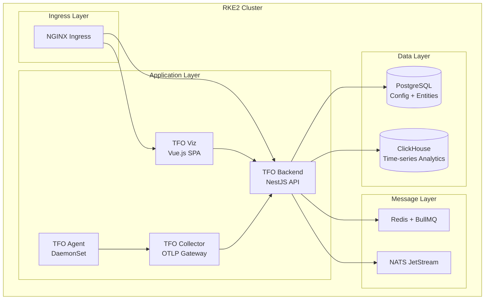
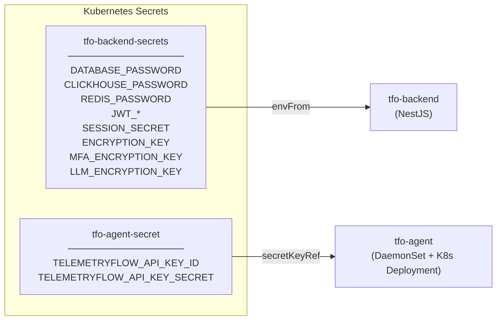

# TelemetryFlow Helm Chart

Helm chart for deploying TelemetryFlow Platform and its Nusametric whitelabel on Kubernetes (RKE2/Rancher).

> **Full installation guide:** [`_infra/docs/INSTALL.md`](../docs/INSTALL.md)

---

## Deployment Architecture



---

## File Structure

```text
helm/
├── Chart.yaml                    # Chart metadata
├── values.yaml                   # Base values — ALWAYS included first
├── values-staging.yaml           # Environment override: staging/demo
├── values-production.yaml        # Environment override: production (HA)
├── values-nusametric.yaml        # Whitelabel override: Nusametric
├── README.md                     # This file
└── templates/
    ├── _helpers.tpl
    ├── namespace.yaml
    ├── rbac.yaml
    ├── secrets.yaml
    ├── configmap-env.yaml
    ├── networkpolicies.yaml
    ├── tfo-platform/             # TFO Backend deployment + service + ingress
    ├── tfo-viz/                  # TFO Viz deployment + service + ingress
    ├── tfo-collector/            # OTLP Collector deployment
    ├── tfo-agent/                # Node agent DaemonSet
    ├── postgresql/
    ├── clickhouse/
    ├── bullmq/                   # Redis StatefulSet + BullMQ board
    └── nats/
```

**Self-contained manifest files** (in `_infra/manifest/`):

```text
manifest/
├── tfo-staging.yaml              # TFO staging — single file, secrets.create: true
├── tfo-production.yaml           # TFO production — single file, secrets.create: false
├── nusametric-staging.yaml       # Nusametric staging — single file, secrets.create: true
└── nusametric-production.yaml    # Nusametric production — single file, secrets.create: false
```

---

## Secret Architecture

Two Kubernetes Secrets are created per deployment (principle of least privilege):



| Secret                | Mounted into                                | Keys                                                       |
| --------------------- | ------------------------------------------- | ---------------------------------------------------------- |
| `tfo-backend-secrets` | `tfo-backend` only                          | DB, JWT, session, encryption                               |
| `tfo-agent-secret`    | `tfo-agent` DaemonSet + K8s Deployment only | `TELEMETRYFLOW_API_KEY_ID`, `TELEMETRYFLOW_API_KEY_SECRET` |

**Staging** (`secrets.create: true`): both secrets are created automatically from the manifest file.

**Production** (`secrets.create: false`): secrets must be provisioned manually before deploying:

```bash
# Backend secrets
kubectl create secret generic tfo-backend-secrets \
  --from-literal=DATABASE_PASSWORD="..." \
  --from-literal=JWT_ACCESS_TOKEN_SECRET="..." \
  ... -n <namespace>

# Agent credentials (separate secret)
kubectl create secret generic tfo-agent-secret \
  --from-literal=TELEMETRYFLOW_API_KEY_ID="tfk_$(openssl rand -hex 16)" \
  --from-literal=TELEMETRYFLOW_API_KEY_SECRET="tfs_$(openssl rand -hex 32)" \
  -n <namespace>
```

> See the full provisioning scripts in the per-environment installation guides under `_infra/docs/`.

### TFO Agent Endpoints

The agent uses **two separate endpoints** — make sure both are reachable:

| Env Var                          | Purpose                                                                         | Default (Helm)                   |
| -------------------------------- | ------------------------------------------------------------------------------- | -------------------------------- |
| `TELEMETRYFLOW_BACKEND_ENDPOINT` | Backend REST API: DB Monitoring, QAN, instance/cluster registration, agent auth | `http://tfo-backend:3100/api/v2` |
| `TELEMETRYFLOW_ENDPOINT`         | OTLP collector: telemetry ingestion (metrics, logs, traces via HTTP)            | `http://tfo-collector:4318`      |

Override in `values.yaml` or environment-specific files:

```yaml
tfoAgent:
  endpoints:
    backend: "https://api.example.com/api/v2" # external backend
    otlp: "http://gateway-collector:4318" # custom collector
```

---

## Values Layering

Helm merges values left to right. Values on the right override values on the left.

| Deployment            | Files (left to right)                                               |
| --------------------- | ------------------------------------------------------------------- |
| TFO Staging           | `values.yaml` + `manifest/tfo-staging.yaml`                         |
| TFO Production        | `values.yaml` + `values-production.yaml`                            |
| Nusametric Staging    | `values.yaml` + `manifest/nusametric-staging.yaml`                  |
| Nusametric Production | `values.yaml` + `values-nusametric.yaml` + `values-production.yaml` |

---

## Quick Start

### TFO Staging

```bash
helm upgrade --install telemetryflow . \
  -f values.yaml \
  -f ../manifest/tfo-staging.yaml \
  -n observability --create-namespace \
  --timeout 15m --wait
```

### Nusametric Staging

```bash
helm upgrade --install nusametric . \
  -f values.yaml \
  -f ../manifest/nusametric-staging.yaml \
  -n nusametric-staging --create-namespace \
  --timeout 15m --wait
```

### TFO Production

```bash
helm upgrade --install telemetryflow . \
  -f values.yaml \
  -f values-production.yaml \
  -n observability --timeout 20m --wait
```

### Nusametric Production

```bash
helm upgrade --install nusametric . \
  -f values.yaml \
  -f values-nusametric.yaml \
  -f values-production.yaml \
  -n nusametric --timeout 20m --wait
```

---

## Components & Resources

| Component      | Type        | Staging Replicas | Production Replicas   | Storage      |
| -------------- | ----------- | ---------------- | --------------------- | ------------ |
| TFO Backend    | Deployment  | 1                | 3–10 (HPA)            | —            |
| TFO Viz        | Deployment  | 1                | 2–6 (HPA)             | —            |
| TFO Collector  | Deployment  | 1                | 2–8 (HPA)             | —            |
| TFO Agent      | DaemonSet   | 1/node           | 1/node                | —            |
| PostgreSQL     | StatefulSet | 1                | 1 primary             | 20Gi / 200Gi |
| ClickHouse     | StatefulSet | 1 shard          | 2 shards × 2 replicas | 20Gi / 500Gi |
| Redis (BullMQ) | StatefulSet | 1 master         | Sentinel (1+2+3)      | 5Gi / 50Gi   |
| NATS           | StatefulSet | 1                | 3-node cluster        | 2Gi / 20Gi   |

---

## Dry Run

```bash
# Preview rendered templates
helm template telemetryflow . \
  -f values.yaml \
  -f ../manifest/tfo-staging.yaml \
  --namespace telemetryflow-staging

# Test install without applying
helm install telemetryflow . \
  -f values.yaml \
  -f ../manifest/tfo-staging.yaml \
  -n observability \
  --dry-run --debug
```

---

## Documentation

- [Full Installation Guide](../docs/INSTALL.md) — Prerequisites, all install scenarios, secrets management, troubleshooting
- [TelemetryFlow Staging Guide](../docs/install-tfo-staging.md)
- [TelemetryFlow Production Guide](../docs/install-tfo-production.md)
- [Nusametric Staging Guide](../docs/install-telemetryflow-staging.md)
- [Nusametric Production Guide](../docs/install-telemetryflow-production.md)
- [values.yaml](values.yaml) — Default base values with full comments
- [values-staging.yaml](values-staging.yaml) — Staging overrides
- [values-production.yaml](values-production.yaml) — Production overrides (HA)
- [values-nusametric.yaml](values-nusametric.yaml) — TelemetryFlow whitelabel overrides
