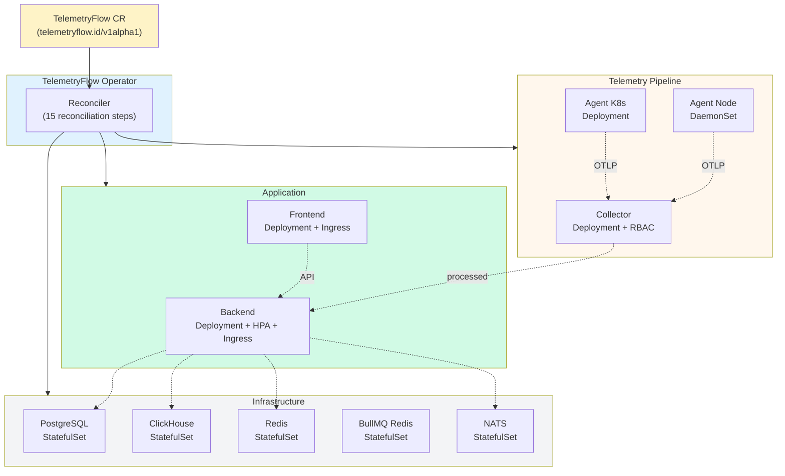

<div align="center">
  <picture>
    <source media="(prefers-color-scheme: dark)" srcset="https://github.com/telemetryflow/.github/raw/main/docs/assets/tfo-logo-dark.svg">
    <source media="(prefers-color-scheme: light)" srcset="https://github.com/telemetryflow/.github/raw/main/docs/assets/tfo-logo-light.svg">
    
  </picture>

  <h3>TelemetryFlow Operator</h3>

[](../CHANGELOG.md)
[](https://opensource.org/licenses/Apache-2.0)
[](https://hub.docker.com/r/telemetryflow/telemetryflow-operator)
[](https://go.dev/)
[](https://kubernetes.io/)
[](https://book.kubebuilder.io/)
[](https://github.com/kubernetes-sigs/controller-runtime)
[](https://kustomize.io/)
[](https://github.com/kubernetes-sigs/controller-tools)
[](https://golangci-lint.run/)
[](./api/v1alpha1/telemetryflow_types.go)

<center>Kubernetes Operator for managing the full
<br><strong>TelemetryFlow Observability Platform</strong> lifecycle via Custom Resources</center>

</div>

---

## Overview

**TelemetryFlow Operator** is a Kubernetes-native controller that manages the
complete lifecycle of a TelemetryFlow deployment through a single
`TelemetryFlow` Custom Resource (CR). Built with [Kubebuilder v4](https://book.kubebuilder.io/)
and Go 1.26, it declaratively reconciles every platform component — from
infrastructure (PostgreSQL, ClickHouse, Redis, NATS) to the application layer
(Backend, Frontend, Collector, Agent).

A single CR creation triggers reconciliation of up to **15 managed workloads**
across Deployments, StatefulSets, DaemonSets, Services, Ingresses, HPAs, RBAC,
ConfigMaps, and Secrets — with automatic garbage collection on deletion.

## Features

### Managed Components

| Component        | Kind           | Default Image                                  | Purpose                                              |
| ---------------- | -------------- | ---------------------------------------------- | ---------------------------------------------------- |
| **PostgreSQL**   | StatefulSet    | `postgres:16-alpine`                           | Relational database (IAM, config, state)             |
| **ClickHouse**   | StatefulSet    | `clickhouse/clickhouse-server:24-alpine`       | High-volume time-series storage                      |
| **Redis**        | StatefulSet    | `redis:7-alpine`                               | L1/L2 caching                                        |
| **BullMQ Redis** | StatefulSet    | `redis:7-alpine`                               | Job queue backend                                    |
| **NATS**         | StatefulSet    | `nats:2-alpine`                                | JetStream messaging                                  |
| **Collector**    | Deployment     | `telemetryflow/telemetryflow-collector:1.2.1`  | OTLP-native telemetry ingestion (gRPC + HTTP)        |
| **Agent (Node)** | DaemonSet      | `telemetryflow/telemetryflow-agent:1.2.0`      | Per-node OS metrics via host mounts                  |
| **Agent (K8s)**  | Deployment     | `telemetryflow/telemetryflow-agent:1.2.0`      | Cluster-wide Kubernetes state collection             |
| **Backend**      | Deployment     | `telemetryflow/backend:latest`                 | NestJS API + IAM + RBAC                              |
| **Frontend**     | Deployment     | `telemetryflow/frontend:latest`                | Vue 3 visualization UI                               |

### Operator Capabilities

- **Declarative Reconciliation** — create-or-update semantics for all owned resources with owner references and garbage collection
- **Finalizer-Based Cleanup** — safe teardown that removes the finalizer only after status is set to `Terminating`
- **EKS Scheduling** — per-component `nodeSelector`, `tolerations`, `topologySpreadConstraints`, and `affinity`
- **Per-Component Ingress** — independent backend and frontend Ingress with TLS, class name, annotations, and custom paths
- **Horizontal Pod Autoscaler** — optional backend HPA with CPU and memory utilization targets
- **Security Hardened** — non-root containers, read-only filesystems, seccomp `RuntimeDefault`, dropped capabilities, `SYS_PTRACE` only where required
- **Persistence** — optional PVCs with configurable storage class and size per stateful component
- **Status Reporting** — phase (`Deploying` / `Ready` / `Failed` / `Terminating`), per-component status map, and conditions (`Progressing`, `Ready`)
- **Leader Election** — safe to run multiple replicas via `--leader-elect`
- **Health Probes** — `/healthz` and `/readyz` endpoints for liveness and readiness

## Architecture



### Reconciliation Pipeline

The reconciler runs these steps in order. A failure in any step sets the phase
to `Failed` and requeues after 5 seconds:

```mermaid
graph LR
    S1["postgresql"] --> S2["clickhouse"]
    S2 --> S3["redis"]
    S3 --> S4["bullmq-redis"]
    S4 --> S5["nats"]
    S5 --> S6["collector-rbac"]
    S6 --> S7["collector"]
    S7 --> S8["agent-rbac"]
    S8 --> S9["agent-daemonset"]
    S9 --> S10["agent-k8s"]
    S10 --> S11["backend"]
    S11 --> S12["frontend"]
    S12 --> S13["backend-ingress"]
    S13 --> S14["frontend-ingress"]
    S14 --> S15["backend-hpa"]
    S15 --> SEC["secrets<br/>(optional)"]
    SEC --> READY["phase: Ready"]

    style READY fill:#d1fae5
```



## Quick Start

### Prerequisites

| Tool             | Version  | Purpose                              |
| ---------------- | -------- | ------------------------------------ |
| go               | >= 1.26  | Build the operator                   |
| kubectl          | >= 1.32  | Apply manifests to a cluster         |
| docker           | >= 24.0  | Build the container image            |
| make             | any      | Task runner                          |
| A K8s cluster    | >= 1.32  | RKE2, EKS, kind, minikube, etc.      |

### 1 — Run Locally (Development)

```bash
# Install CRDs into your cluster (uses current kubeconfig)
make install

# Run the operator against the cluster
make run
```

### 2 — Deploy to a Cluster

```bash
# Build the image
make docker-build IMG=telemetryflow/telemetryflow-operator:1.5.0

# (Push to your registry if remote)
make docker-push IMG=telemetryflow/telemetryflow-operator:1.5.0

# Deploy the controller manager
make deploy IMG=telemetryflow/telemetryflow-operator:1.5.0
```

### 3 — Create a TelemetryFlow Instance

Apply the sample CR or your own:

```bash
kubectl apply -f config/samples/telemetryflow_v1alpha1_telemetryflow.yaml
```

Watch the reconciliation:

```bash
kubectl get telemetryflow -n telemetryflow -w
# NAME                    PHASE    READY   VERSION   AGE
# telemetryflow-sample    Ready    true    1.4.2     2m
```

Inspect per-component status:

```bash
kubectl describe telemetryflow telemetryflow-sample -n telemetryflow
```

### 4 — Cleanup

```bash
# Delete the CR (triggers finalizer cleanup)
kubectl delete telemetryflow telemetryflow-sample -n telemetryflow

# Undeploy the operator
make undeploy

# Remove CRDs
make uninstall
```

## Custom Resource

The `TelemetryFlow` CR is defined at `telemetryflow.id/v1alpha1`. A minimal
example:

```yaml
apiVersion: telemetryflow.id/v1alpha1
kind: TelemetryFlow
metadata:
  name: telemetryflow-prod
  namespace: telemetryflow
spec:
  version: "1.5.0"

  backend:
    image: telemetryflow/tfo-backend:1.4.2
    replicas: 3
    resources:
      requests: { cpu: "1", memory: 1Gi }
      limits:   { cpu: "2", memory: 2Gi }
    autoscaling:
      enabled: true
      minReplicas: 3
      maxReplicas: 15
      targetCPUUtilizationPercentage: 65
    ingress:
      enabled: true
      className: nginx
      host: api.telemetryflow.id
      tls: true
      tlsSecretName: telemetryflow-api-tls
    scheduling:
      nodeSelector:
        eks.amazonaws.com/nodegroup: telemetryflow-production
      topologySpreadConstraints:
        - maxSkew: 1
          topologyKey: topology.kubernetes.io/zone
          whenUnsatisfiable: DoNotSchedule

  agent:
    enabled: true
    image: telemetryflow/telemetryflow-agent:1.2.0
    node:
      enabled: true        # DaemonSet (per-node OS metrics)
    kubernetes:
      enabled: true        # Deployment (cluster-wide K8s state)

  postgresql:
    image: postgres:16-alpine
    persistence:
      enabled: true
      size: "50Gi"

  secrets:
    create: false          # use pre-provisioned secrets
```

See [config/samples/telemetryflow_v1alpha1_telemetryflow.yaml](./config/samples/telemetryflow_v1alpha1_telemetryflow.yaml)
for the full spec with every field, and [api/v1alpha1/telemetryflow_types.go](./api/v1alpha1/telemetryflow_types.go)
for the type definitions.

### Status

The operator reports status with three columns visible via `kubectl get`:

| Column    | JSONPath                  | Description                                  |
| --------- | ------------------------- | -------------------------------------------- |
| `Phase`   | `.status.phase`           | `Deploying`, `Ready`, `Failed`, `Terminating` |
| `Ready`   | `.status.ready`           | `true` when all steps reconciled             |
| `Version` | `.spec.version`           | Platform version string                       |

The `.status.componentStatuses` map tracks each reconciliation step individually.

## Repository Structure

```
operator/
├── main.go                              # Entrypoint (manager setup, flags, probes)
├── go.mod                               # Module: github.com/telemetryflow/telemetryflow-operator
├── Makefile                             # Build, test, lint, deploy, docker targets
├── Dockerfile                           # Multi-stage (golang:1.26-alpine → alpine:3.21)
├── PROJECT                              # Kubebuilder project metadata (v4 layout)
├── run-container.sh                     # Docker build/tag/push helper
│
├── api/v1alpha1/                        # CRD type definitions
│   ├── groupversion_info.go             # Group: telemetryflow.id, Version: v1alpha1
│   ├── telemetryflow_types.go           # TelemetryFlow spec/status types
│   └── zz_generated.deepcopy.go         # Generated DeepCopy methods
│
├── internal/controller/
│   └── telemetryflow_controller.go      # Reconciler (1470 lines, 15 steps + finalizer)
│
├── config/                              # Kustomize manifests
│   ├── crd/
│   │   ├── bases/                       # Generated CRD YAML
│   │   └── kustomization.yaml
│   ├── manager/
│   │   ├── manager.yaml                 # Controller Deployment (health probes, resources)
│   │   └── kustomization.yaml
│   ├── rbac/
│   │   ├── role.yaml                    # ClusterRole (scoped permissions)
│   │   ├── role_binding.yaml
│   │   └── service_account.yaml
│   └── samples/
│       └── telemetryflow_v1alpha1_telemetryflow.yaml  # Full example CR
│
└── tests/
    ├── unit/
    │   └── controller_test.go           # envtest unit tests (no real cluster)
    ├── e2e/
    │   ├── e2e_suite_test.go            # Suite setup (namespace, kubeconfig)
    │   ├── e2e_test.go                  # Full, minimal, delete, update scenarios
    │   ├── startup_test.go              # Startup verification
    │   ├── collection_test.go           # Telemetry collection tests
    │   ├── pipeline_test.go             # Pipeline verification
    │   ├── shutdown_test.go             # Shutdown verification
    │   ├── testdata/                    # Test fixtures
    │   └── README.md                    # E2E testing guide
    └── integration/                     # Integration tests (placeholder)
```

## Makefile Commands

```bash
make help                # Show all available commands

# Build
make build               # Build operator binary (fmt + vet + manifests + generate)
make run                 # Build and run operator locally
make version             # Show version info
make info                # Show build configuration

# Code Generation
make manifests           # Generate CRD, RBAC manifests (controller-gen)
make generate            # Generate DeepCopy methods
make generate-manifests  # Generate all manifests and code

# Testing
make test                # Unit tests via envtest (K8s 1.31, no cluster needed)
make test-e2e            # E2E tests against a real cluster
make test-coverage       # Generate HTML coverage report

# Code Quality
make fmt                 # Format code (go fmt)
make fmt-check           # Check formatting (CI gate)
make vet                 # Run go vet
make staticcheck         # Run staticcheck v0.7.0
make lint                # Run golangci-lint v1.59.0
make lint-fix            # Run golangci-lint with auto-fix
make check               # fmt + vet + lint + test

# Dependencies
make deps                # Download and tidy modules
make tidy                # Tidy go modules
make verify              # Verify dependencies

# Deployment
make install             # Install CRDs into cluster
make uninstall           # Remove CRDs from cluster
make deploy              # Deploy controller manager (set IMG)
make undeploy            # Remove controller manager

# Docker
make docker-build        # Build image (set IMG)
make docker-push         # Push image (set IMG)
make docker-buildx       # Multi-platform build (arm64, amd64, s390x, ppc64le)
make docker-run          # Run the image interactively

# Misc
make clean               # Clean build artifacts and coverage files
```

## Testing

### Unit Tests (envtest)

Unit tests run against a temporary `etcd` + `kube-apiserver` via
[envtest](https://book.kubebuilder.io/reference/envtest.html) — no real cluster
required. Perfect for CI.

```bash
make test                # Runs ./tests/unit/... with envtest (K8s 1.31)
make test-coverage       # Generates coverage.html and coverage-summary.txt
```

### E2E Tests (real cluster)

E2E tests verify the full operator lifecycle against a running cluster with the
operator deployed. Four scenarios are covered:

| Test                | Description                                                              |
| ------------------- | ------------------------------------------------------------------------ |
| Full platform       | All components deploy and reach `Ready` phase                            |
| Minimal deployment  | Only backend + PostgreSQL; agent DaemonSet is not created                |
| Deletion & cleanup  | CR deletion garbage-collects all managed resources                       |
| Update              | Scaling `spec.backend.replicas` 1 → 3 reconciles the Deployment          |

```bash
# Using kind
kind create cluster --name tfo-e2e
make install
make deploy IMG=telemetryflow/telemetryflow-operator:1.5.0
make test-e2e
kind delete cluster --name tfo-e2e
```

See [tests/e2e/README.md](./tests/e2e/README.md) for full E2E instructions.

## Docker

The operator ships as a minimal multi-stage image:

| Stage     | Base                  | Purpose                         |
| --------- | --------------------- | ------------------------------- |
| Build     | `golang:1.26-alpine`  | Compile static `manager` binary |
| Runtime   | `alpine:3.21`         | Distroless-like runtime (uid 10001) |

Security defaults: non-root user (`operator:10001`), `dumb-init` as PID 1,
`/healthz` healthcheck, CA certs and timezone data included.

```bash
# Build
docker build -t telemetryflow/telemetryflow-operator:1.5.0 .

# Or use the helper script
./run-container.sh -b -t 1.5.0
./run-container.sh -c          # build, tag, and push
```

## Security

The operator follows least-privilege and hardening principles:

- **RBAC**: scoped ClusterRole limited to the resources the reconciler manages
- **Agent RBAC**: read-only access to nodes, pods, services, metrics, and non-resource URLs
- **Non-root manager**: runs as uid 10001 in both container and cluster deployment
- **Read-only root filesystem** where supported
- **Seccomp**: `RuntimeDefault` on all pods
- **Capabilities**: `ALL` dropped; `SYS_PTRACE` added only for the node agent (host access)
- **Owner references**: all managed resources are owned by the CR for automatic GC
- **Finalizer**: `telemetryflow.id/finalizer` prevents orphaned resources on deletion

See [../SECURITY.md](../SECURITY.md) and [../docs/SECURITY-GUIDE.md](../docs/SECURITY-GUIDE.md)
for platform-wide security details.

## Technology Stack

| Category        | Technology           | Version    |
| --------------- | -------------------- | ---------- |
| Language        | Go                   | 1.26       |
| Framework       | Kubebuilder          | v4         |
| Controller Lib  | controller-runtime   | v0.20.4    |
| Kubernetes API  | k8s.io/*             | v0.32.3    |
| Envtest K8s     | setup-envtest        | 1.31       |
| Kustomize       | kustomize            | v5.4.2     |
| Controller Gen  | controller-tools     | v0.16.1    |
| Linter          | golangci-lint        | v1.59.0    |
| Static Analysis | staticcheck          | v0.7.0     |
| Testing         | Ginkgo + Gomega      | v2.22 / v1.36 |
| Test Assertions | testify              | v1.11.1    |
| Runtime Base    | Alpine               | 3.21       |

## Documentation

| Resource             | Link                                                                      | Description                          |
| -------------------- | ------------------------------------------------------------------------- | ------------------------------------ |
| Operator Guide       | [../docs/OPERATOR-GUIDE.md](../docs/OPERATOR-GUIDE.md)                    | Operator development guide           |
| CRD Types            | [api/v1alpha1/telemetryflow_types.go](./api/v1alpha1/telemetryflow_types.go) | Spec and status type definitions     |
| Sample CR            | [config/samples/](./config/samples/)                                      | Full example custom resource         |
| E2E Test Guide       | [tests/e2e/README.md](./tests/e2e/README.md)                              | End-to-end testing instructions      |
| Architecture         | [../docs/ARCHITECTURE.md](../docs/ARCHITECTURE.md)                        | Platform architecture and diagrams   |
| Deployment Guide     | [../docs/DEPLOYMENT.md](../docs/DEPLOYMENT.md)                            | Step-by-step deployment              |
| Contributing         | [../CONTRIBUTING.md](../CONTRIBUTING.md)                                  | Contribution guidelines              |
| Changelog            | [../CHANGELOG.md](../CHANGELOG.md)                                        | Version history                      |
| License              | [../LICENSE](../LICENSE)                                                  | Apache License 2.0                   |

## Contributing

We welcome contributions! Please read the [Contributing Guide](../CONTRIBUTING.md)
for code style (Go: Effective Go, table-driven tests), commit conventions
(Conventional Commits), and the PR process.

Quick checks before submitting a PR:

```bash
make check    # fmt + vet + lint + test
```

## License

Apache License 2.0 — see [LICENSE](../LICENSE) for details.

## Acknowledgments

Part of [TelemetryFlow Platform](https://github.com/telemetryflow/telemetryflow-platform) —
AI-Powered Observability & Incident Response Management (IRM) Platform.

---

**Built with ❤️ by Telemetri Data Indonesia**
