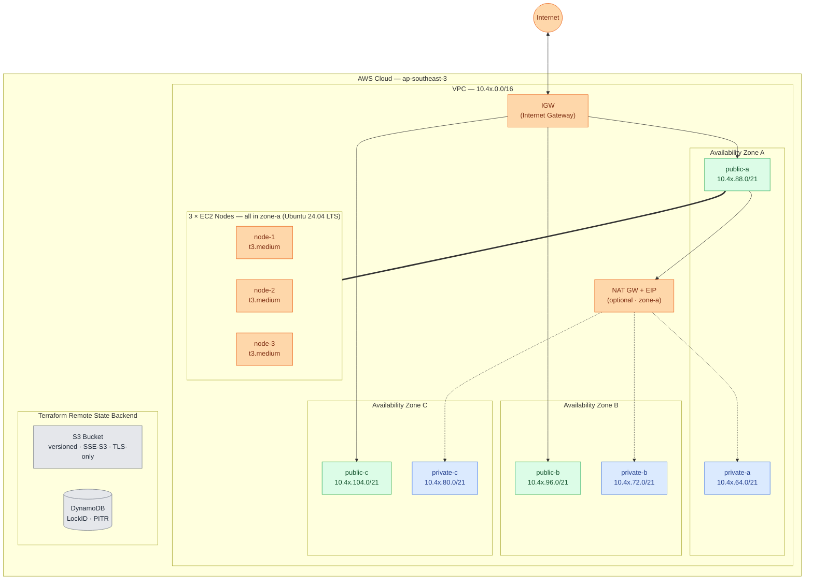
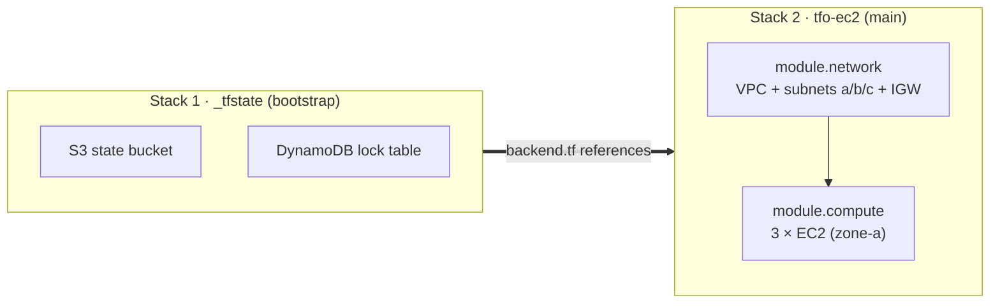

<div align="center">

# TelemetryFlow Platform — Terraform IaC (AWS)

**Modular Terraform for EC2 infrastructure: VPC (multi-AZ), IGW, optional NAT, 3 EC2 nodes, and an S3 + DynamoDB remote-state backend.**

[](https://developer.hashicorp.com/terraform/downloads)
[](https://registry.terraform.io/providers/hashicorp/aws/latest)
[](https://opensource.org/licenses/Apache-2.0)
[](https://aws.amazon.com/)

</div>

---

## Table of Contents

- [Overview](#overview)
- [Architecture](#architecture)
- [Repository Structure](#repository-structure)
- [Prerequisites](#prerequisites)
- [Modules](#modules)
  - [`network`](#network-module)
  - [`compute`](#compute-module)
  - [`tfstate`](#tfstate-module)
  - [`eks`](#eks-module)
- [Environments](#environments)
- [Quick Start](#quick-start)
- [Workspaces](#workspaces)
- [Configuration Reference](#configuration-reference)
- [State Management](#state-management)
- [Cost Estimation (Infracost)](#cost-estimation-infracost)
- [Security Best Practices](#security-best-practices)
- [Troubleshooting](#troubleshooting)
- [Cleanup](#cleanup)
- [License](#license)

---

## Overview

This repository contains **reusable, modular Terraform** for provisioning
TelemetryFlow Platform's EC2 infrastructure on AWS. It follows the two-tier
pattern popularized by production AWS layouts:

1. **`modules/`** — generic, reusable modules (no environment-specific values).
2. **`environment/`** — per-deployment wiring that calls the modules with
   concrete account IDs, CIDRs, and instance settings.

The network module provisions a **multi-AZ VPC (a, b, c)** so it is reusable
for future HA workloads, while the `tfo-ec2` environment deploys **3 EC2 nodes
into a single availability zone (zone-a)** per the current requirement.

### What it provisions

| Layer           | Resources                                                                                                   |
| --------------- | ----------------------------------------------------------------------------------------------------------- |
| **Network**     | VPC, 6 subnets (public + private × a/b/c), IGW, public route tables                                         |
| **NAT** _(opt)_ | EIP, single NAT GW (zone-a), private route tables (a/b/c → NAT)                                             |
| **Compute**     | Launch template, 3× EC2 instances (zone-a), 2× SGs, IAM role + profile                                      |
| **EKS** _(opt)_ | EKS 1.35 cluster, OIDC, 3× t3.large workers, managed add-ons, CSI drivers (Pod Identity), IAM roles, SG, S3 |
| **State**       | S3 bucket (versioned, encrypted, TLS-only), DynamoDB lock table                                             |

---

## Architecture

> Diagrams render natively on GitHub. Solid arrows = traffic flow; dotted = optional NAT path; thick = node placement.

### Network topology (multi-AZ VPC) + EC2 node placement



### Deployment sequence (two-stack ordering)



---

## Repository Structure

```
terraform/
├── README.md                          # This document
├── .gitignore
│
├── modules/                           # Reusable modules (environment-agnostic)
│   ├── network/                       # VPC + subnets (a,b,c) + IGW + optional NAT
│   │   ├── main.tf                    #   locals: env, tags
│   │   ├── vpc.tf                     #   aws_vpc
│   │   ├── subnet.tf                  #   6 subnets (pub/priv × a,b,c)
│   │   ├── igw.tf                     #   IGW + 3 public route tables
│   │   ├── nat.tf                     #   optional NAT GW + private route tables
│   │   ├── sg.tf                      #   default VPC security group
│   │   ├── variable.tf                #   inputs
│   │   ├── output.tf                  #   outputs (vpc, subnets a/b/c)
│   │   ├── provider.tf                #   required providers
│   │   └── HOW-TO.md
│   │
│   ├── compute/                       # 3 EC2 nodes (single AZ)
│   │   ├── main.tf                    #   locals: env, common_tags
│   │   ├── ami.tf                     #   Ubuntu 24.04 / Amazon Linux 2023 lookup
│   │   ├── instance.tf                #   launch template + 3 instances + EIC endpoint
│   │   ├── sg.tf                      #   main SG + instance-connect SG
│   │   ├── iam-profile.tf             #   IAM role + instance profile
│   │   ├── variable.tf                #   inputs
│   │   ├── output.tf                  #   instance IDs, IPs, template
│   │   ├── template/
│   │   │   └── user_data.sh           #   cloud-init (Docker, CW agent, sysctl)
│   │   └── HOW-TO.md
│   │
│   └── tfstate/                       # S3 + DynamoDB remote state backend
│       ├── main.tf
│       ├── s3.tf                      #   versioned, encrypted, TLS-only bucket
│       ├── dynamodb.tf                #   LockID table + PITR
│       ├── variable.tf
│       ├── output.tf
│       ├── provider.tf
│       └── HOW-TO.md
│
│   └── eks/                          # EKS 1.35 observability cluster
│       ├── main.tf                    #   locals: env, tags
│       ├── _eks_cluster.tf            #   aws_eks_cluster + OIDC
│       ├── _eks_nodes.tf              #   worker node group (3× t3.large)
│       ├── _eks_addons.tf             #   kube-proxy, vpc-cni, coredns, snapshot-controller
│       ├── _eks_csi_drivers.tf        #   pod-identity-agent, EBS/EFS CSI (Pod Identity)
│       ├── _eks_iam.tf                #   cluster/node/CSI/CA/ALB IAM roles
│       ├── _eks_sg.tf                 #   EKS security group
│       ├── _eks_s3.tf                 #   private S3 bucket
│       ├── variable.tf / _eks_var.tf  #   inputs
│       ├── output.tf / output-addons.tf
│       ├── provider.tf
│       ├── backend.tf.example
│       ├── HOW-TO.md / README.md
│       └── LIST-ADDONS.md
│
└── environment/telemetryflow/         # Deployment wiring
    ├── _tfstate/                      # BOOTSTRAP — run first (creates state backend)
    │   ├── main.tf                    #   calls modules/tfstate
    │   ├── provider.tf
    │   ├── backend.tf.example         #   S3 backend template
    │   ├── variable.tf                #   account/bucket defaults
    │   ├── terraform.tfvars.example   #   copy → terraform.tfvars
    │   └── HOW-TO.md
    │
    └── tfo-ec2/                       # MAIN — run second (VPC + 3 EC2 nodes)
        ├── main.tf                    #   calls modules/network + modules/compute
        ├── provider.tf
        ├── backend.tf.example
        ├── remote_states.tf           #   reads _tfstate outputs
        ├── variable.tf                #   compute + global config
        ├── variable-core.tf           #   VPC/subnet CIDRs (a,b,c)
        ├── terraform.tfvars.example
        └── HOW-TO.md
    │
    └── tfo-eks/                       # EKS — run third (observability cluster 1.35)
        ├── main.tf                    #   calls modules/eks
        ├── provider.tf
        ├── backend.tf.example
        ├── remote_states.tf (in module) # reads tfo-ec2 VPC/subnet outputs
        ├── variable.tf                #   cluster + node + addon config
        ├── terraform.tfvars.example
        └── HOW-TO.md
```

---

## Prerequisites

| Tool                                                             | Version                        | Purpose                                    |
| ---------------------------------------------------------------- | ------------------------------ | ------------------------------------------ |
| [Terraform](https://developer.hashicorp.com/terraform/downloads) | `>= 1.9.8` (latest stable 1.x) | IaC execution                              |
| [tenv](https://github.com/tofuutils/tenv) _(recommended)_        | `>= 3.2`                       | Terraform version manager                  |
| [AWS CLI](https://aws.amazon.com/cli/)                           | `v2`                           | Credential verification & ad-hoc AWS calls |
| An AWS account                                                   | —                              | With permission to create VPC/EC2/S3/IAM   |

### AWS Credentials Setup

Configure a named profile in `~/.aws/credentials` and `~/.aws/config`:

```ini
# ~/.aws/credentials
[TFO-TF-User-Executor]
aws_access_key_id     = AKIAxxxxxxxxxxxxxxxx
aws_secret_access_key = xxxxxxxxxxxxxxxxxxxxxxxxxxxxxxxxxxxxxxxx
```

```ini
# ~/.aws/config
[profile TFO-TF-User-Executor]
region = ap-southeast-3
output = json
```

Verify access before running Terraform:

```bash
unset AWS_SESSION_TOKEN AWS_SECRET_ACCESS_KEY AWS_ACCESS_KEY_ID
export AWS_PROFILE=TFO-TF-User-Executor
export AWS_DEFAULT_REGION=ap-southeast-3

aws sts get-caller-identity --profile $AWS_PROFILE
```

---

## Modules

### `network` module

Provisions a **multi-AZ VPC** with public and private subnets in zones a, b, c,
an Internet Gateway, an optional NAT Gateway, and a default security group.

| Input               | Type          | Description                                    |
| ------------------- | ------------- | ---------------------------------------------- |
| `aws_region`        | `string`      | AWS region                                     |
| `coreinfra`         | `string`      | Core infrastructure name prefix                |
| `vpc_cidr`          | `map(string)` | VPC CIDR per workspace                         |
| `ec2_public_a/b/c`  | `map(string)` | Public subnet CIDRs per workspace              |
| `ec2_private_a/b/c` | `map(string)` | Private subnet CIDRs per workspace             |
| `enable_nat`        | `bool`        | Create single NAT GW (zone-a) + private routes |
| `igw_prefix`        | `string`      | IGW name prefix                                |
| `ec2_prefix`        | `string`      | EC2 subnet name prefix                         |

| Output                 | Description                        |
| ---------------------- | ---------------------------------- |
| `vpc_id` / `vpc_cidr`  | VPC identity & CIDR                |
| `security_group_id`    | Default VPC security group         |
| `ec2_public_1a/1b/1c`  | Public subnet IDs (a, b, c)        |
| `ec2_private_1a/1b/1c` | Private subnet IDs (a, b, c)       |
| `nat_gateway_id`       | NAT GW ID (when `enable_nat=true`) |

See [`modules/network/HOW-TO.md`](modules/network/HOW-TO.md) for details.

### `compute` module

Provisions **N EC2 instances** (default 3) via a launch template, all placed in
a single availability zone. Includes IAM instance profile, security groups, and
an optional EC2 Instance Connect endpoint.

| Input                     | Default      | Description                              |
| ------------------------- | ------------ | ---------------------------------------- |
| `instance_count`          | `3`          | Number of nodes                          |
| `instance_type`           | `t3.medium`  | EC2 instance type                        |
| `ami_os`                  | `ubuntu`     | `ubuntu` (24.04) or `amazon_linux_2023`  |
| `root_volume_size`        | `30`         | Root EBS size (GB, gp3, encrypted)       |
| `enable_access_public_ip` | `true`       | `false` → private subnet (needs NAT/SSM) |
| `create_instance_connect` | `true`       | EC2 Instance Connect endpoint            |
| `key_pair_name`           | _(required)_ | SSH key pair name                        |

| Output                 | Description              |
| ---------------------- | ------------------------ |
| `instance_ids`         | List of EC2 instance IDs |
| `instance_private_ips` | Private IP addresses     |
| `instance_public_ips`  | Public IP addresses      |
| `launch_template_id`   | Launch template ID       |
| `latest_ami_id`        | Resolved AMI ID          |

See [`modules/compute/HOW-TO.md`](modules/compute/HOW-TO.md) for details.

### `tfstate` module

Creates the **remote state backend**: a versioned, encrypted, TLS-enforcing S3
bucket and a DynamoDB lock table with point-in-time recovery.

| Input                    | Description                          |
| ------------------------ | ------------------------------------ |
| `tfstate_bucket`         | S3 bucket name for `.tfstate` files  |
| `tfstate_dynamodb_table` | DynamoDB table name for locking      |
| `tfstate_encrypt`        | Encrypt state at rest (default true) |

> This is a **bootstrap** module — apply once with local state, then migrate.

See [`modules/tfstate/HOW-TO.md`](modules/tfstate/HOW-TO.md) for details.

### `eks` module

Provisions the **observability EKS cluster** (Kubernetes **1.35**) with managed
add-ons, EBS/EFS CSI drivers via **EKS Pod Identity**, an OIDC provider,
cluster-autoscaler + AWS Load Balancer Controller IAM roles, a worker node group
defaulting to **3 × t3.large**, and a private S3 bucket.

| Input                        | Default                                   | Description                           |
| ---------------------------- | ----------------------------------------- | ------------------------------------- |
| `k8s_version`                | `1.35`                                    | EKS cluster + node version            |
| `eks_node_type`              | `t3.large` (prod `m5.large`)              | Worker instance type                  |
| `eks_node_storage`           | `50` (prod `100`)                         | Worker node disk (GB)                 |
| `node_counts`                | `{worker=3, worker_max=10, worker_min=1}` | Worker node scaling                   |
| `ebs_csi_driver_version`     | `v1.50.0-eksbuild.1`                      | EBS CSI add-on (see `LIST-ADDONS.md`) |
| `efs_csi_driver_version`     | `v2.2.5-eksbuild.1`                       | EFS CSI add-on                        |
| `kube_proxy_version`         | `v1.35.1-eksbuild.1`                      | kube-proxy add-on                     |
| `vpc_cni_version`            | `v1.21.0-eksbuild.1`                      | VPC CNI add-on                        |
| `coredns_version`            | `v1.13.1-eksbuild.1`                      | CoreDNS add-on                        |
| `pod_identity_agent_version` | `v1.4.0-eksbuild.1`                       | Pod Identity Agent add-on             |

| Output                               | Description                        |
| ------------------------------------ | ---------------------------------- |
| `eks_cluster_name`                   | EKS cluster name                   |
| `eks_cluster_endpoint`               | API server endpoint                |
| `eks_nodegroup_workers_id`           | Worker node group ID               |
| `eks_oidc_provider_arn`              | OIDC provider ARN (for IRSA roles) |
| `ebs_csi_driver_role_arn`            | EBS CSI Pod Identity role ARN      |
| `cluster_autoscaler_role_arn`        | cluster-autoscaler OIDC role ARN   |
| `kubeconfig` / `config_map_aws_auth` | kubeconfig + aws-auth body         |

See [`modules/eks/HOW-TO.md`](modules/eks/HOW-TO.md) and
[`modules/eks/LIST-ADDONS.md`](modules/eks/LIST-ADDONS.md) for details.

---

## Environments

| Path                                  | Purpose                           | Run order |
| ------------------------------------- | --------------------------------- | --------- |
| `environment/telemetryflow/_tfstate/` | Bootstrap S3 + DynamoDB backend   | **1st**   |
| `environment/telemetryflow/tfo-ec2/`  | VPC (multi-AZ) + 3 nodes (zone-a) | **2nd**   |
| `environment/telemetryflow/tfo-eks/`  | EKS 1.35 observability cluster    | **3rd**   |

Each environment uses **Terraform workspaces** (`default`, `lab`, `staging`,
`prod`) to separate deployments within a single stack. Workspace-keyed map
variables (e.g. `vpc_cidr`, `environment`) select per-environment values.

---

## Quick Start

### Step 1 — Bootstrap the state backend (`_tfstate`)

> This creates the S3 bucket + DynamoDB table that **all** stacks use. Apply
> with local state first, then migrate into the bucket you just created.

```bash
cd environment/telemetryflow/_tfstate

# Configure for your account
cp terraform.tfvars.example terraform.tfvars
#   → edit: aws_account_id_destination, tfstate_bucket, region

# Init (local state — no backend yet)
terraform init

# Create workspace
terraform workspace new default   # or: lab / staging / prod

# Apply
terraform plan
terraform apply

# Migrate state into the bucket you just created
cp backend.tf.example backend.tf
#   → edit backend.tf to match terraform.tfvars bucket/table/key
terraform init --migrate-state
```

### Step 2 — Provision the EC2 infrastructure (`tfo-ec2`)

```bash
cd environment/telemetryflow/tfo-ec2

# Configure
cp terraform.tfvars.example terraform.tfvars
#   → edit: account id, key_pair_name, instance settings, CIDRs

# Configure backend (must match Step 1 bucket)
cp backend.tf.example backend.tf

# Init + deploy
terraform init
terraform workspace new default   # or: lab / staging / prod
terraform plan
terraform apply
```

### Step 3 — Provision the EKS observability cluster (`tfo-eks`)

> Requires Step 2 (`tfo-ec2`) to be applied — `tfo-eks` reads VPC/subnet/SG
> outputs via `terraform_remote_state`.

```bash
cd environment/telemetryflow/tfo-eks

# Configure
cp terraform.tfvars.example terraform.tfvars
#   → edit: account id, SSH key, Route53 zone, addon versions (optional)

# Configure backend (must match Step 1 bucket)
cp backend.tf.example backend.tf

# Init + deploy
terraform init
terraform workspace new staging   # or: lab / prod
terraform plan
terraform apply

# Connect to the cluster
aws eks update-kubeconfig --region ap-southeast-3 --name tfo-eks-staging
```

### Step 4 — Verify

```bash
# Instances up?
aws ec2 describe-instances \
  --filters "Name=tag:Name,Values=tfo-ec2-instance-*" \
  --query "Reservations[*].Instances[*].[InstanceId,PrivateIpAddress,PublicIpAddress,State.Name]" \
  --output table

# Connect via SSM (no SSH key needed)
aws ssm start-session --target <instance-id>
```

---

## Workspaces

Each stack supports workspace-based environment separation:

```bash
# Create all environments
terraform workspace new lab
terraform workspace new staging
terraform workspace new prod

# Deploy to staging
terraform workspace select staging
terraform plan
terraform apply

# Deploy to prod
terraform workspace select prod
terraform plan
terraform apply
```

Workspace values drive the `map()` variables — CIDRs, tags, and prefixes all
key off `terraform.workspace`:

| Workspace | `environment` tag | VPC CIDR (default) |
| --------- | ----------------- | ------------------ |
| `default` | `DEF`             | `10.40.0.0/16`     |
| `lab`     | `RND`             | `10.40.0.0/16`     |
| `staging` | `STG`             | `10.41.0.0/16`     |
| `prod`    | `PROD`            | `10.42.0.0/16`     |

---

## Configuration Reference

Copy `terraform.tfvars.example` → `terraform.tfvars` in each stack and edit.
Key variables for `tfo-ec2`:

| Variable                  | Default          | Description                       |
| ------------------------- | ---------------- | --------------------------------- |
| `aws_region`              | `ap-southeast-3` | AWS region                        |
| `instance_type`           | `t3.medium`      | EC2 instance type                 |
| `instance_count`          | `3`              | Number of nodes (all zone-a)      |
| `ami_os`                  | `ubuntu`         | `ubuntu` or `amazon_linux_2023`   |
| `key_pair_name`           | `tfo-ssh-key`    | Pre-existing SSH key pair         |
| `enable_nat`              | `false`          | NAT GW for private subnet egress  |
| `enable_access_public_ip` | `true`           | Public IP on nodes (else private) |
| `create_instance_connect` | `true`           | EC2 Instance Connect endpoint     |

---

## State Management

All stacks store state in the S3 bucket created by `_tfstate`, with locking
via DynamoDB:

```
terraform {
  backend "s3" {
    region         = "ap-southeast-3"
    bucket         = "tfo-tf-state-<account>-ap-southeast-3"
    dynamodb_table = "tfo-ddb-tf-state-<account>-ap-southeast-3"
    key            = "telemetryflow/<account>/tfo-ec2/terraform.tfstate"
    encrypt        = true
  }
}
```

### Migrate state

```bash
mv backend.tf.example backend.tf   # then edit
terraform init --migrate-state
```

---

## Cost Estimation (Infracost)

[Infracost](https://www.infracost.io) estimates the monthly cloud cost of both
stacks and posts a cost-diff comment on pull requests that touch this Terraform.

### Files

| File                          | Purpose                                         |
| ----------------------------- | ----------------------------------------------- |
| `infracost.yml`               | Multi-project config (`_tfstate` + `tfo-ec2`)   |
| `infracost-usage-tfstate.yml` | Usage estimates for S3 + DynamoDB state backend |
| `infracost-usage-tfo-ec2.yml` | Usage estimates for NAT GW egress + EBS volumes |

### Local usage

```bash
# One-time auth (free key from https://dashboard.infracost.io)
infracost auth login

# Table summary of both stacks
make infracost

# JSON export (for CI artifacts)
make infracost-json

# HTML dashboard
make infracost-dashboard
```

Or run directly:

```bash
infracost breakdown --config-file infracost.yml --format table
```

### CI (GitHub Actions)

`.github/workflows/infracost.yml` runs on PRs touching `_infra/infra-telemetryflow/terraform/`
and posts a cost-diff comment. It needs the repo secret:

```
Secret name:        INFRACOST_API_KEY
Value:              <free key from dashboard.infracost.io>
```

### Tuning usage estimates

Edit the `infracost-usage-*.yml` files to match real usage (NAT egress, request
counts, etc.). Sync the files against the current Terraform:

```bash
infracost breakdown --config-file infracost.yml --sync-usage-file
```

---

## Security Best Practices

- **No secrets in code** — credentials live in `~/.aws/credentials`, never in
  `.tf`/`.tfvars` files.
- **`*.tfvars` is gitignored** — copy `.example` files locally only.
- **State is encrypted** — S3 SSE + DynamoDB PITR + TLS-only bucket policy.
- **IMDSv2 enforced** — launch template requires session tokens.
- **EBS encrypted** — all root volumes use AWS-managed encryption.
- **Least-privilege IAM** — SSM + S3 read-only + CloudWatch agent only.

### Pre-commit security checklist

- [ ] No AWS credentials (access keys, secret keys)
- [ ] No real AWS account IDs in committed files
- [ ] No private SSH keys (`id_rsa`, `id_rsa.pub`)
- [ ] No ARNs of real resources
- [ ] `backend.tf` and `*.tfvars` are gitignored (not committed)

---

## Troubleshooting

| Symptom                               | Fix                                                                      |
| ------------------------------------- | ------------------------------------------------------------------------ |
| `Error: BucketAlreadyExists`          | Choose a globally unique `tfstate_bucket` name.                          |
| `Error: InvalidAvailabilityZone`      | Region may not have 3 AZs — check `aws ec2 describe-availability-zones`. |
| Nodes have no outbound internet       | Private subnet needs `enable_nat = true`.                                |
| `ssh: connect to host` times out      | Use SSM (`aws ssm start-session`) or Instance Connect.                   |
| `terraform validate` fails after edit | Run `terraform fmt -recursive` then re-validate.                         |

---

## Cleanup

Destroy in **reverse order** (compute first, then state backend):

```bash
# 1. Destroy EC2 + VPC
cd environment/telemetryflow/tfo-ec2
terraform workspace select default
terraform destroy

# 2. (Optional) Destroy state backend — WARNING: deletes all state history
cd ../_tfstate
terraform workspace select default
terraform destroy
```

---

## License

**Copyright 2024-2026 Telemetri Data Indonesia (telemetryflow.id)**

Licensed under the Apache License, Version 2.0 (the "License");
you may not use this file except in compliance with the License.
You may obtain a copy of the License at

    http://www.apache.org/licenses/LICENSE-2.0

Unless required by applicable law or agreed to in writing, software
distributed under the License is distributed on an "AS IS" BASIS,
WITHOUT WARRANTIES OR CONDITIONS OF ANY KIND, either express or implied.
See the License for the specific language governing permissions and
limitations under the License.
